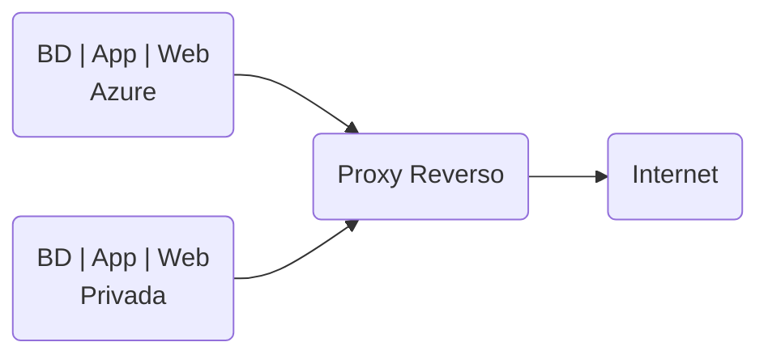
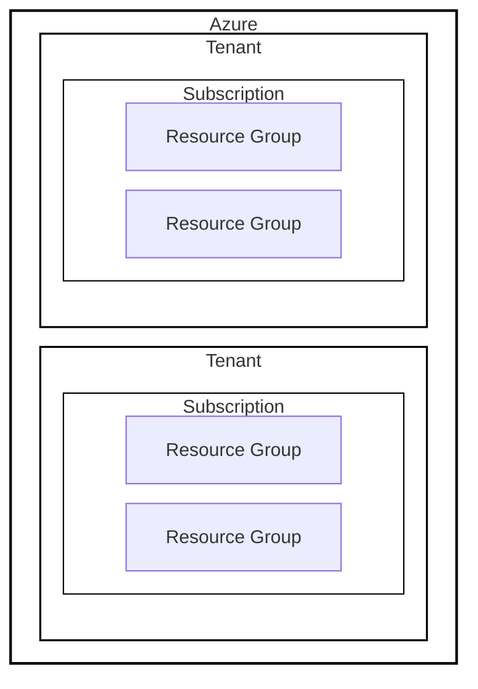
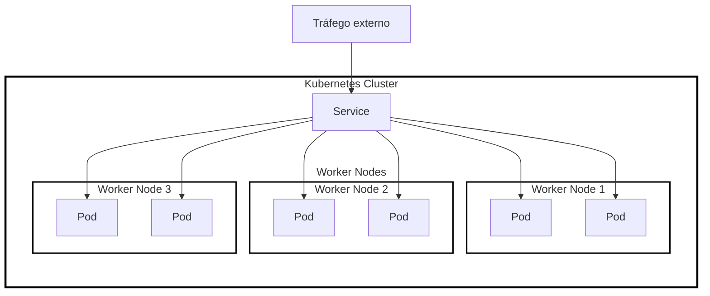
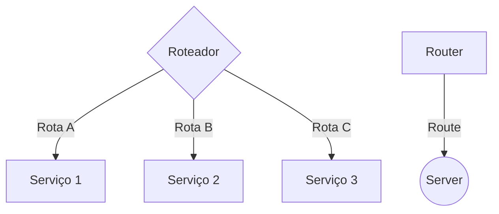
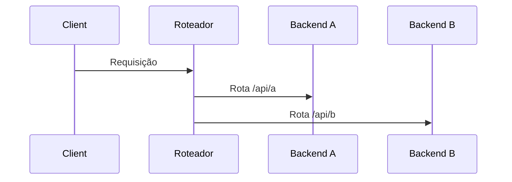

# Cloud Computing

Resumo/Transcrição dos slides de aula da disciplina Computação em Nuvem

> **Observação**: caso tenha `[...]` em algum tópico, isso implica que eu não terminei a anotação, sendo necessário olhar os slides diretamente.

# Introdução

## Introdução à Computação em Nuvem

### História

[...]

#### Evolução

[...]

#### Primeiros passos 

[...]

#### Amazon EC2 (Elastic Compute Cloud) - 2006

[...]

#### Amazon S3 (Simple Storage Service)

[...]

#### Amazon RDS (Relational Database Service)

[...]

#### Google Apps e a Computação Empresarial

[...]

#### Google App Engine - 2008

[...]

### Computação em Nuvem na visão moderna

[...]

#### Definição

##### NIST

"Modelo para habilitar **acesso conveniente e sob demanda a um pool compartilhado de recursos** configuráveis de computação que podem ser **rapidamente provisionados e liberados** com **esforço mínimo de gerenciamento ou interação com o provedor de serviços**"

##### Gartner

"Estilo de computação no qual **capacidades de TI escaláveis e elásticas são fornecidas como um serviço** para clientes externos usando **tecnologias da internet**"

##### Forrester

"Capacidade de TI padronizada entregue via tecnologias da internet de maneira **paga por uso e de autoatendimento**"

#### Resumo

- **Menos impostos**: gastos em cloud entram como despesas e não como investimentos
- **Sob demanda**
- **Mais escalabilidade**
- **Menos osciosidade**: paga somente pelo uso, se tiver usando pouco, reduz a máquina e paga menos
- **Infraestrutura ágil**: menor investimento inicial e instalação rápida através de autoatendimento

#### Caraterísticas

- **Elasticidade**: capacidade de **aumentar ou diminuir recursos automaticamente conforme demanda**
  - atua de forma **reativa** e **automática**, corrigindo picos e quedas.
  - depende de paramêtros pré configurados como limite de uso, mínimos e máximos, etc
  - não requer planejamento prévio, age depender dos limites.
- **Escalabilidade**: capacidade de **adicionar ou remover recursos conforme a necessidade**, sem interrupções para suportar mais carga. Normalmente planejado, como cenários da black friday e outros.
  - ajuste conforme a demanda
  - capacidade de escalar ou reduzir rapidamente para atender a picos de uso sem superdimensionamento ou subutilização
- **Flexibilidade**: capacidade da infraestrutura de se adaptar a diferentes necessidades, estando relacionado a liberdade de escolha e adapção estrutural, como por exemplo a alterar infraestrutura física do hardware, ligar/desligar remotamente, etc.
  - trocar uma VM com GPU por outra; mudar engine de DB;
  - diferentes ambientes
  - alterar configurações de rede ou segurança
- **Pagamento por uso**: modelo de cobrança baseado no **consumo real de recursos**
- **Redução de custo e agilidade**: menos investimento em compra e manutenção de infraestrutura física e custos operacionais previsíveis.
- **Agilidade Organizacional**: rapidez na implementação de soluções com tempo de provisionamento de recursos significativamente mais rápidos, permitindo adaptação às mudanças do mercado e flexibilidade estrutural mais rápido.

#### Desafios e Riscso

##### Segurança e Privacidade

A proteção de dados sensíveis torna um dos pontos críticos na migração para cloud, necessitando garantir a confidencialidade, integridade e disponibilidade dos dados, uma vez que perde o controle físico do acesso. 
Para tal, é necessário implementar medidas de seguranças robustas como criptografia e controle de acesso.
Mover dados de negócios para a nuvem compartilha a responsabilidade de segurança com o provedor, aumentando a exposição de dados e criando desafios adicionais de segurança.

##### Dependência do Fornecedor

Existe o risco de **lock-in** e falta de flexibilidade. 
Cada fornecedor possui suas especifidades que tornam-se diferenciais competitivos. No entanto, essas especificidades tornam-se impeditivos na migração de fornecedores devido a sua exclusividade. Neste caso mostra-se a importância de escolher fornecedores que ofereçam interoperabilidade e padrões abertos.

##### Complexidade no gerenciamento

A migração pra cloud traz complexidade no gerenciamento, sendo necessário novas habilidades, ferramentas e mão de obra especializadas no provedor, tal qual o a implantação de ferramentas de automação e monitoramento para garantir eficiência operacional.
Um ponto crítico geral no uso de cloud é que investigação forense não permite acesso a logs de máquina, dificultando perícias.

Além disso, ao utilizar cloud, parte da infraestrutura passa a ser operada pelo provedor. A organização mantém a responsabilidade pela governança do ambiente, mas menor controle direto sobre a infraestrutura física e processos operacionais.

##### Conformidade Legal

A localização física dos dados pode ser desconhecida, criando desafios de conformidade com regulamentos locais governamentais.

#### Raízes Tecnológicas

##### Clustering

**Grupo de recursos de TI independentes interconectados atuando como um único sistema**. Aumenta a disponibilidadade e confiaiblidade dos serviços devido à redundância e aos mecanismos de falha embutidos.

Algumas das características incluem:
- **Homogeneidade**: componentes tem hardware e SOs semelhantes;
- **Alta disponibilidade**: redundância e failover embutidos aumentam a confiabilidade;
- **Localização**: normalmente no mesmo datacenter;
- **Comunicação**: comunicação rápida e eficiente através de links dedicados.

Pode ser:
- **Horizontal**: adição de mais máquinas ou nós ou cluster
  - **Escalabilidade**: adicionar mais nós;
  - **Disponibilidade**: + capacidade de processamento e resiliência
  - **Uso comum**: aplicações que necessitam de load balancer como servidores web
  - Quando usar: cenários onde a carga de trabalho pode ser distribuída em múltiplos nós
- **Verticial**: aumento da capacidade dos nós existentes (upgrade de recursos como CPU e RAM)
  - **Performance**: aumenta a performance de cada nó individualmente
  - **Complexidade**: mais caso e complexo devido a limitações de hardware
  - **Uso comum**: aplicações que exigem alta performance em um único nó, como database.
  - Quando usar: aumento da capacidade em um único nó é mais eficiente que adicionar novos nós, tal qual onde a latência e a velocidade de acesso são críticas.

Resumo das diferenças:
- **Escalabilidade**: horizontal adiciona nós, verticial os melhora;
- **Custo**: horizontal pode ser mais econômico e flexível, vertical pode ser mais caro e complexo;
- **Aplicações**: horizontal para LB e resiliência, vertical para alta preformance em nós únicos.

##### Grid Computing

**organiza recursos computacionais em pools lógicos**, formando um **supercomputador virtual**. Difernete do clustering, o grid é mais distribuído e heterogêneo, permitindo recursos dispersos e variados trabalhem juntos de forma paralela.

Algumas das características incluem:
- **Heterogeneidade**: pode incluir recursos com diferentes hardwares e SOs;
- **Distribuição geográfica**: recursos podem estar dispersos;
- **Escalabilidade**: capacidade de incluir recursos adicionais facilmente;
- **Flexilbidade**: utiliza middleware para coordenar recursos, permitindo maior felxibilidade na alocação e uso

##### Diferenças entre Grid e Clustering

- Clusters são homogeneros e grids são heterogeneos;
- Clusters são localizados, grids são distribuídos;
- clusters usam links dedicados, grids usam middleware para coordenação;
- Clusters são usados para alta disponibilidade/LB, grids são usados para alta performance distribuída.

##### Virtualização

É a tecnologia que **permite a criação de instâncias virtuais de recursos físicos de TI**, permitindo que **múltiplos usuários compartilhem as capacidades de processamento subjacentes sem estarem vinculados ao hardware físico**. Gestão e alocação de recursos de maneira **flexível e eficiente**.

##### Conceitos e terminologia básica

###### Cloud ou nuvem

**Ambiente de TI projetado para o provisionamento remote de recursos escaláveis e medidos**. A nuvem permite que serviços sejam **escalados conforme a necessidade**, atendendo as demandas variáveis de forma eficiente.

###### Recursos de TI

Podem ser físicos ou virtuais, abrangendo servidores físicos e softwares personalizados. Essenciais para a operação de serviços em nuvem.

###### On-premise

Recursos on-premise são hospedados dentro de um limite organizacional tradicional e não são baseados em nuvem.
Oferecem maior controle e segurança locais, mas exigem maiores investimentos iniciais e custos operacionais contínuos.

###### Consumidores e provedores

Consumidores são entidades que utilizam recursos de TI baseados em nuvem.
Provedores são entidades que fornecem recursos e gerenciam a infraestrutura subjacente, garantindo que os serviços sejam entregues de maneira eficiente e segura.

##### Tipos de escalabilidade

##### Escalabilidade Horizontal

**Envolve a adição ou remoção de recursos do mesmo tipo**, conhecida como scaling out e scaling in.

##### Escalabilidade Vertical

**Refere-se à substituição de recursos por outros de capacidade diferente**, conhecida como scaling up e scaling down.

##### Diferenças entre os tipos de escalabilidade

<table>
  <thead>
    <tr>
      <th>Escalabilidade Horizontal</th>
      <th>Escalabilidade Vertical</th>
    </tr>
  </thead>
  <tbody>
    <tr>
      <td>Mais barata (hardware genérico - commodity)</td>
      <td>Mais caro (hardware específico)</td>
    </tr>
    <tr>
      <td>Recursos de TI disponíveis de imediato</td>
      <td>Recursos de TI disponíveis de imediato</td>
    </tr>
    <tr>
      <td>Replicação de recursos automatizada</td>
      <td>Configuração adicional específica necessária</td>
    </tr>
    <tr>
      <td>Necessidade de mais recursos de TI</td>
      <td>Não é necessário mais recursos de TI</td>
    </tr>
    <tr>
      <td>Não é limitado pela capacidade intrínseca do hardware</td>
      <td>Limitado à capacidade máxima do hardware</td>
    </tr>
  </tbody>
</table>

##### Benefícios do Cloud Computing

- Redução de investimento inicial
- Custos proporcionais sob demanda
- Flexibilidade e escalabilidade

# Funções e Tipos de Serviços

## Fundamentação e Modelos de Serviço

### Funções e Limites

- Governança e terceirização: como os recusos de TI são gerenciados e utilizados
- Compreender responsabilidades e controle sobre os recursos em um ambiente de cloud, limites organizacionais, confiança e segurança.

#### Roles

##### Provedor

Aquele que  **provê/disponibiliza o serviço**, incluindo armazenamento, processamento e serviços de rede. Além de fornecer, também gerencia a infraestrutura para garantir que os serviços sejam entregues de acordo com os SLAs

##### Consumidor

Aquele que  **utiliza os serviços fornecidos pelo provedor**. O acesso aos recursos é feito através de interfaces programáticas como APIs e aplicativos web.
Ele tem como responsabilidade gerenciar a utilização dos recursos de nuvem de forma eficaz para obter os benefícios da migração.
Aquele que **compra serviços de cloud e revendem para ampliar suas ofertas de serviços se enquadram como consumidor e provedor**.

##### Proprietário

Aquele que  **possui legalmente um serviço na nuvem, implicando responsabilidades legais e de manutenção**. Pode ser tanto o provedor quanto o consumidor, depende de quem desenvolveu e implantou o serviço.
Por exemplo quem desenvolve um software e disponibiliza-o na nuvem pode ser tanto consumidor (usa a infra de um provider), quanto um proprietário (detém os direitos do software).

##### Administrador de recursos de nuvem

Aquele que **gerencia os recursos de TI na nuvem, tanto a nível interno (atuando no consumidor) e externo (atuando no provedor)**. Tem como papel manter a disponibilidade, segurança e desempenho dos serviços oferecidos.

##### Auditor

Aquele que **realiza avaliações independentes da segurança, privacidade e desempenho dos serviços na nuvem a fim de construir confiança**.

##### Broker

Aquele que **atua como intermediario, negociando e gerenciando a utilização de serviços entre consumidores e provedores**. Um exemplo é o pacote Office da PUC, o qual não é comprado diretamente na Microsoft, mas sim através de um intermediario.

##### Carrier

Aquele que **fornece a conectividade de rede necessária para que consumidorees possam acessar os serviços em nuvem**

#### Limites Organizacionais

Representa a fronteira física que circunda os recursos de TI de uma organização, delimitando quais recursos estão sobre sua propriedade e controle direto. Por exemplo contratar serviços de cloud e não querer que um funcionario específico do provedor controle seus serviços. Apesar de ser possível, o provedor pode negar, uma vez que não tem acesso direto ao limite organizacional do provedor.

#### Limite de confiança

Fronteira lógica que se estende para incluir componentes do ambiente de nuvem nos quais a organização decide confiar, como serviços ou infraestruturas de terceiros.

#### Exercicio

[...]

#### Características

- **Elasticidade** que permite a **escalabilidade** automática;
- **Uso sob demanda**;
- **Resiliência**, que assegura a continuidade dos serviços mesmo diante de falhas.

##### Uso sob demanda

Permite que consumidores **provisionem e utilizem recursos de TI conforme a necessidade sem precisar de interação direta com o provedor**. Isso garante **flexibilidade e eficiência operacional**.

##### Acesso Ubíquo

Capacidade de **acessar recursos em qualquer lugar**.
Apesar da disponibilidade completa dos serviços, deve-se lembrar sobre os limites de rede, que inicialmente são completamente liberados mas devem ser bloqueados para garantir segurança.

##### Multitenancy (muitos locatários)

Capacidade de **disponibilização de recursos de TI para múltiplos consumidores de forma isolada** Cada consumidor (**tenant**) utiliza o serviço sem ter acesso aos dados ou configuranções dos outros, garantindo segurança e privacidade.
A aplicação deve manter segregação de performance e recursos**, uma vez que se o usuário do Tenant A utilizar 100% dos recursos, não deve afetar a utilização do usuário do Tenant B.

##### Pooling de Recursos

É o conceito de que os provedores podem agrupar recursos de TI como armazenamento e processamento, para atender a vários consumidores simultaneamente, otimizando o uso dos recursos disponíveis. Este modelo é eficiente e permite uma melhor alocação de recursos de acordo com as necessidades variáveis dos consumidores. Muitas vezes utilizado em ambientes **multitenant** para dar flexibilidade na alocação dinâmica de recursos e melhorar a disponibilidade.

##### Elasticidade

Refere-se à capacidade de um sistema em núvem **ajustar automatizamente os recursos de TI**, escalando-os para cima ou para baixo conforme necessidade dentro dos limites pré-configurados.
Para o funcionamento da elasticidade vertical transparente, é necessário que o Hypervisor do SO da máquina seja ser orientado a eventos e suportar adição e remoção de recursos dinâmicamente sem reboot. Além disso, o Guest OS deve ter suporte a Hot-add-on, para entender quando ocorre alocação de CPU ou RAM e adaptar o sistema. No entanto, ele não entende de forma natural a desalocação (Hot-Remove). Para solucionar, é necessário subir uma nova instância, transferir os usuários conectados para a nova e realizar o desligamento da instância alterada.

##### Pay as you go

Capacidade da plataforma de nuvem de monitorar e registrar o uso dos recursos permitindo a cobrança precisa conforme o uso real. Além de servir como base para a cobrança, fornece dados para monitoramento e otimização de serviços a fim de ajustar suas ofertas para todos os consumidores.

##### Resiliência

Capacidade de um sistema de se recuperar rapidamente de falhas e continuar operando sem interrupções significativas. Pode ser obtida através da replicação de recursos e dados em múltiplas localizações físicas (datacenters diferentes), garantindo que se um componente falhas, outro possa assumir automaticamente a carga de trabalho.

##### Estudo de caso

[...]

### Ofertas e Serviços

#### IaaS - Infrastructure as a Service

Aluguel de infraestrutura de TI virtualizada (aluguem de VMs, redes, armazenamento). Esses recursos são provisionados e gerenciados pelo provedor, mas cabe ao consumidor a responsabilidade pela gerencia do SO, como upgrades, manutenção, etc.
Ideal para organizações que necessitam de alto nível de controle sobre a infraestrutura de TI, garantindo personalização e escalabilidade dos recursos. Alta flexibilidade, mas alta complexidade na gestão.
Se compra o serviddor virtual com 32GB RAM, 4GB de local storage, 99.5% de disponibilidade sem falhas por $0.95 a hora e $0.05 por GB tranfesrido na rede.

#### PaaS - Platform as a Service

Ambiente completo e pré-configurado onde os desenvolvedores sobem o código e já funciona. Neste cenário o provedor administra a infraestrutura, sendo responsavel por manter o SO, permitindo que os desenvolvedores concentrem-se apenas no desenvolvimento.
Se compra uma aplicação de alta disponibilidade por $0.45 a hora ou 500.000 requests com 99.5% de disponibilidade com auto-scaling.

#### SaaS - Software as a Service

Sofware é hospedado e mantido pelo provedor e disponibilizado aos consumidores via internet. Os consumidores não precisam se preocupar com a instalação, manutenção ou instalação do software ou infraestrutura, limitando sua gestão ao uso e às configurações disponibilizadas pela aplicação.
Se compra acesso a aplicação cobrando $0.05 a cada 100 requests com um response time de 0.5ms

# Tipos de Núvem

## Tipos de Nuvem

### Conceito de Nuvem Pública

- Ambiente de núvem acessível ao público, de propriedade e mantido por um provedor tercerizado, de forma que múltiplos usuários compartilhem recursos via internet.
- Aluguel de recursos computacionais.
- Vantagens:
  - Escalabilidade;
  - Custo reduzido;
  - Ausência de manutenção por parte do usuário.
- Menor controle sobre aspectos de segurança e personalização dos serviços.
- Exige atenção a custos, configurações e segurança.
- Provedor ganha dinheiro no **oversubscription**, ou seja, vende muito recurso e nunca é utilizado 100% da cota.
- Usos: aplicativos web que exigem flexibilidade e alta disponibilidade; ambientes de desenvolvimento e testes;

### Conceito de Nuvem Privada

- Infraestrutura cloud exclusiva para uma única organização, podendo ser interna ou mantida por um provedor (mas sempre com uso dedicado à organização proprietária).
- Maior controle sobre os recursos e dados, personalização e segurança.
- Custos mais elevados e requer um gerenciamento contínuo.
- Organização atua como provedor e consumidor dos recursos de TI.
- Usos: setores regulados que exisgem alta segurança dos dados ou personalização.

### Núvem privada é mais que um datacenter

**Possuir servidores/datacenter próprio não é necessariamente nuvem privada**, pois ela **precisa implementar caracteristicas específicas de cloud**, como por exemplo **automação, provisionamento sob demanda, elasticidade e gerenciamento centralizado sobre os recursos**.

### Conceito de Nuvem Comunitária

- Nuvem privativa dentro de um grupo de empresas para resolver o problema da nuvem privada ser cara, garantindo a customização. Similar a uma nuvem pública, mas restrito a uma comunidade específica de usuários que comparitlham interesses ou requisitos comuns.
- Permitem o compartilhamento de custos e recursos entre os membros, além de garantir conformidade com normas específicas do setor.
- Frequentemente usada em setores regulatórios como saúde e finanças para cumprir regulações específicas; projetos colaborativos entre diferentes organizações com objetivos e necessidades similares.
- O problema: governança da nuvem. Quem irá administrar e ser responsável pelas decisões? Quais decisões podem ser tomadas?
  - Custos e recursos compartilhados, políticas de segurança comuns.
  - A solução: joint-venture, uma nova empresa onde todos são societários para gerencia da cloud.

### Conceito de Nuvem Híbrida

- Oferece flexibilidade para as organizações permitindo a combinação de elementos de núvem pública, privada e/ou comunitária. 
- Usos: expansão de recursos, migrações graduais, resiliência e continudade de serviços, segurança dos dados (armazenamento dos dados em núvem privada e disponibilidade em nuvem pública)
- O problema: fazer os ambientes trabalharem juntos, necessitando de conectividade segura, maior complexidade de gerenciamento e sincronização, controle de acessos etc.



### Comparando os tipos de nuvem

- A nuvem pública oferece menor controle, mas é mais econômica e escalável, sendo mantida por terceiros.
- A nuvem privada proporciona alto controle e segurança, mas a um custo maior, sendo exclusiva para uma única organização.
- A nuvem comunitária compartilha recursos e custos entre membros de uma comunidade específica, combinando segurança e conformidade com regulamentações.
- A nuvem híbrida integra aspectos dos outros modelos, oferecendo flexibilidade, mas com desafios adicionais na gestão e integração dos ambientes.

### Nuvem Híbrida e Multicloud

Apesar de serem conceitos relacionados, **não são a mesma coisa**. Multicloud reduz a dependência de um único fornecedor, mas ainda utiliza apenas nuvens públicas. Já a nuvem híbrida alterna entre diferentes tipos de ambientes.

### Edge Computing

Para reduzir latência, implementa mini datacenters ao lado de antenas 5G para processamento de dados em tempo real.

### Serverless

Provedor gerencia grande parte da infra necessária para executar uma aplicação, deixando o desenvolvedor focado no código. Recursos sob demanda através de triggers, como schedulers, endpoints de API entre outros.

### Nuvem Soberana e Soberania dos Dados

Alguns cenários é necessário controlar não apenas quem acessa os dados, mas também onde estão armazenados e suas legislações locais. A depender da legislação, o governo pode ter acesso a dados sensíveis.

### RBAC - Role Based Access Control

Protocolo de controle de permissão por grupos



Onde:
- Tenant: empresa
- Subscription: site/projeto
- Resource Group: subdivisões internas

### Explorando a Azure

#### Ambiente Privado dentro de uma Nuvem Pública

O Azure organiza seus recursos em camadas administrativas que ajudam a controlar custos, permissões, políticas e sepração entre ambientes.
[...]

# Responsabilidade Compartilhada

## Tipos de serviços e Responsabilidade Compartilhada

### Tipos de Serviço

### Responsabilidade Compartilhada nos Diferentes Modelos de Serviço em Cloud

# Cloud Maturity Model

## Cloud Maturity Model

O CMM foi originalmente desenvolvido para apoiar organizações no planejamento e evolução da adoção de cloud. 
Seu propósito é auxiliar as organizações a avaliar seu estado atual de maturidade em nuvem e definir o estado desejado de acordo com seus objetivos de negócio, identificando lacunas entre a situação atual e a desejada, criando um roadmap de evolução.
Permite avaliar a adoção considerando aspectos organizacionais e tecnológicos relacionados a governança, processos, pessoas e tecnologia.

### Níveis de Maturidade no CMM

- **Nível 0 - Legacy**: sistemas legados sem adoção de nuvem;
- **Nível 1 - Initial, Ad-hoc**: uso inicial e não coordenado de nuvem;
- **Nível 2 - Repeatable, Opportunistic**(Repetitivo): uso consistente com processos replicáveis, mas ainda exploratório;
- **Nível 3 - Defined, Managed**(Gerenciado): processos definidos e gerenciamento sistemático da núvem;
- **Nível 4 - Measured, Measurable**(Mensurado): uso avançado com métricas e otimização;
- **Nível 5 - Optimized**(Otimizado): Uso totalmente otimizado, alinhado com os objetivos de negócio

Não é necessário que todas as empresas adotem o nível 5 de maturidade. Cada caso é um caso, as vezes é exagero.

### Estrutura da Avaliação

O CMM não avalia somente infraestrutura ou tecnologias específicas, mas também diferentes domínios de maturidade que permitem analisar capacidades relevantes para adoção de cloud.
A versão atual contempla 31 domínios técnicos e não técnicos como finanças, cultura, compliance, comercial, arquitetura de TI, segurança, redes, etc. E cada um dos domínios podem possuir domínios diferentes.

### Níveis

#### Nível 0 - Legacy

Aplicações predominantemente executadas em infraestrutura tradicional _on-premise_ com poucos processos internos, sem uma estratégica ou abordagem definida para adoção de cloud

Desafios:
- Infraestrutura pouco flexível para mudanças;
- Processos de provisionamento manuais;
- Custos e capacidades frequentemente associados à aquisição antecipada de infraestrutura.

#### Nível 1 - Initial, Ad-hoc

Adoção inicial e não coordenada de serviços de nuvem. Processos podem existir, mas são manuais.
Uma prática comum é o ShadowIT, o uso de serviços de nuvem por áreas ou departamentos sem coordenação central do TI.
Uso básico de IaaS e SaaS como ferramentas de produtividade e colaboração. 

Desafios:
- Falta de controle centralizado e governança;
- Uso não planejado e sem políticas claras.

#### Nível 2 - Repeatable, Opportunistic

Uso sistemático da núvem com processos replicáveis, mas ainda exploratório, gerando inconsistência nos processos. Adoção em diferentes áreas da organização, mas sem um plano coeso (sem contrato formal por parte do TI).
Alguns dos padrões ja incluem ambientes de desenvolvimento e teste, além de modelo de pagamento _pay-as-you-go_.
Uso estruturado de IaaS para virtualização de servidores e armazenamento; uso inicial de PaaS para desenvolvimento de software e SaaS para colaboração e comunicação.

Desafios:
- Inconsistência na aplicação de práticas e políticas de nuvem;
- Foco em infraestrutura e serviços básicos.

#### Nível 3 - Defined, Systematic

Processos já definidos, gerenciamento sistemático de núvem com contratos personalizados e governança estabelecida.
Alguns dos padrões comuns incluem governança centralizada e práticas recomendadas de segurança como controle de acesso e monitoramente contínuo.
Uso de IaaS como automação básica e prática de DevOps, SaaS para integração com sistemas legados e funções críticas, PaaS para desenvolvimento. 

Desafios:
- Conformidade e segurança na escala de nuvem;
- Alinhamento entre TI e negócios

#### Nível 4 - Measured, Measurable

Uso mais avançado da núvem com métricas e otimização, com processos de medição e análise para monitorar desempenho.
Alguns dos padrões já incluem o uso de Infrastructure as Code (IaC) para gerenciar recursos através de texto, além de pipelines automatizadas de CI/CD (Continuous Integration/Continuous Deployment).
Como tecnologias inclue-se o uso de IaaS, PaaS, SaaS e FaaS (Function as a Service) para execução de funções sob demanda em ambientes serverless.

Desafios:
- Complexidade crescente;
- Otimização não comprometer segurança.

#### Nível 5 - Optimized

Uso totalmente otimizado e alinhado com os objetivos de negócio, buscando inovação contínua e uso de tecnologias emergentes.
Alguns dos padrões incluem tomada de decis˜ões baseadas em dados e desenvolvimento de aplicativos nativos para a nuvem.
Como tecnologia temos IaaS, PaaS, SaaS totalmente otimizados, FaaS, AI/ML e IoT

Desafios:
- Manter a inovação enquanto gerencia complexidade e risco;
- Sustentar vantagem competitiva através da inovação contínua.

### Implementação na prática

- **Definição do escopo**
- **Seleção dos domínios relevantes**
- **Avaliação do estado atual**
- **Definição do estado desejado**
- **Identificação dos gaps**
- **Roadmap**
- **Monitoramento**

### Benefícios

- **Avaliação estruturada**
- **Identificação de gaps**
- **Planejamento estratégico**
- **Alinhamento com o negócio**
- **Otimização de recursos**

### Desafios

- **Resistência a mudanças**
- **Complexidade na integração**
- **Governança e segurança**
- **Maturidade Desigual**
- **Subjetividade da avaliação**
- **Definição do nível-alvo**

# Bases Tecnológicas

## Redes para Datacenter

### Redes de Computadores

### Datacenters
## Virtualização

### Introdução a Virtualização

### Virtualização de Servidores
# Cloud

## Segregação e Compartilhamento MultiTenancy

Criar grupos na aplicação segregados de forma que um não enxerga o outro.
Exemplo: endereço de e-mail em @puc-campinas.edu.br e @ibm.com, a busca por um usuário na PUC não deve encontrar o usuário da plataforma IBM.
Como: Utilizar o domínio de acesso (@puc-campinas.edu.br) como tag relativa ao usuário e todas as requisições buscar pelo user e tag. Nesse formato de multitenancy não é necessário segregar bancos de dados, podendo utilizar apenas o SQL para segregar com base na tag.

### O que é MultiTenancy

Definição: arquitetura de aplicação onde uma unica instancia atende a míltiplos usuários, chamados tenants (inquilinos) que compartilham os mesmos recursos fisicos ou lógicos.

Isolamento de tenants: cada tenant usa a plicação como se fosse única, com a capacidade de personalizar a interface e fluxos de trabalho. A segurança é garantida através de mecanismos de isolamento de dados, autenticação e criptografia.

Essencial para o modelo SaaS.

### Vantagens

### Desafios

- **Segurança e isolamento**
- **Personalização por tentant**: a necessidade de permitir que cada tenant personalize o sistema sem interferir nos outros aumenta a complexidade
- **Gerenciamento de performance**: uso equilibrado de recursos por tenant para **não afetar o uso dos outros**
    - Se cada tenant for um processo, identifica cada um em um cgroup e limita o uso de cpus
    - Se um processo tem múltiplas threads com cada tenant, a solução é separar os domínios e contabilizar o uso user+tag e limitar a nível de software o uso da aplicação.
- **Backup e recuperação**: implementar processos de backup e recuperação separados por tenant

### Diferenças entre MultiTenancy e Virtualização

Multitenancy: uma única instância da aplicação atende múltiplos tentants isolados lógicamente mas compartilhando recursos
Virtualização: múltiplas instâncias virtuais de servidores operam em uma única máquina física, cada uma funcionando como um ambiente separado com seu próprio sistema operacional
Comparação: a virtualização ---- nao terminei [x]

### Pulou muitos slides

### Orquestração de MultiTenancy em Núvem Pública

- **Compartilhamento de Infraestrutura**: em uma cloud pública, os recursos de computação, armazenamento e rede são compartilhados entre vários tenants.
- **Elasticidade**: recursos como processamento e armazenamento são provisionados dinamicamente, com ajuste automático conforme a demanda de cada tenant aumenta ou diminui
- **Gerenciamento de Containers** tecnologias como kubernetes ajudam a isolar e gerenciar containers dedicados a cada tenant, compartilhando o mesmo hardware
- **Balanceamento de Carga**: serviços como o Elastic Load Balancing (AWS) garantem que as requisições de cada tenant sejam distribuídas eficientemente entre os recursos disponíveis

### Gerenciamento de recursos e performance

#### Isolamento de containers ou VMS

**Containers**: muitos ambientes multitenant usam containers ou vms para isolar os tenants. Cada container pode ter recursos (CPU, memória, etc) limitados, evitando que um tenant ultrapasse seu consumo permitido. Neste caso, temos um ambiente multi-instância, sendo uma instância para cada tenant.

#### Mecanismos de Rate Limiting

**Controle de chamadas e requisições**: limitar o número de requisições que um etnant pode fazer em determinado período de tempo. Isso impede que um tenant com alto volume de solicitações sobrecarregue o sistema.

#### Monitoramento de AutoScaling

#### Política de Penalização

Penalização de tenants de alto consumo: se um tenant ultrapassa o consumo de recursos permitido de forma recorrente, ele pode ser penalizado por meio de throttling (diminuição intencional de desempenho) ou movido para um ambiente de menor prioridade

### Gerenciamento de Identidade e Contexto do Tenant

- Identificador de tenant
- login e autenticação
- Carregamento de dados e configurações
- Ambientes independentes

### Modelos de Armazenamento de Dados em MultiTenancy

- **Banco de dados comparitlhado com esquemas compartilhados**: tenants compartilham as mesmas tabelas com consultas filtradas pelo ID do tenant, garantindo menor custo e eficiência de recursos, mas aumentando a complexidade em segurança
- **Banco de dados compartilhado com esquemas separados**
- **Banco de dados separado**

### Segurança e controle de acesso em multitenant

- Autenticação e autorização baseada em tenant: o sistema de controle de acesso verifica o tenant e ajusta as permissões conforme necessário
- RBAC (Role Based Access Controll): permissões definidas por papéis internos a cada tenant
- Filtragem de Requisições: 
- Criptografia

### Perdi aqui

### Elasticidade e Segurança
## Containers e cgroups

### O que são containers?

Containers são unidades de software que empacotam código e suas dependências, permitindo que as aplicações sejam executadas de maneira isolada e consistente em qualquer ambiente.
Diferente de VMs, os **containers compartilham o mesmo kernel do SO**, mas mantendo isolamento entre as aplicações, diretórios e runtime.
Permitem que o software seja portado de um ambiente para o outro (dev, homolog e prod) sem necessidade de ajustes no código.

### Diferenças entre containers e VMs

Containers:
- Compartilham o kernel do SO
- Leves com consumo reduzido de memória e recursos
- Iniciam rapidamente

VMs:
- Executam seu próprio SO
- Mais pesadas, consumindo mais recursos
- Inicialização lenta devido ao carregamento do SO


### Componentes de um container

- **Imagem**: Um container é criado a partir de uma imagem, que contém o código da aplicação, bibliotecas e demais configurações necessárias para execução. 
- **Registro de Imagens**: Imagens salvas em registros de containers que facilitam download e implantação.
- **Runtime de container**: Software responsável por executar e gerenciar containers, como o Docker e o containerd.
- **Isolamento de recursos**: O isolamento é estabelecido a tempo de execução pelo kernel e pelo runtime através de mecanismos como namespaces e cgroups.

### Isolamento de containers: Namespaces

Namespaces são uma **tecnologia do kernel Linux que cria um ambiente isolado para diferentes aspectos do SO**, como processos, rede e sistema de arquivos.
- **PID Namespace**: isola o espaço de identificação dos processos, de forma que cada container vejam somente seus próprios processos.
- **Net Namespace**: Isola interfaces de rede, IPs e roteamento, para que cada container tenha sua própria rede virtual.
- **Mount Namespace**: Isola o sistema de arquivos, criando uma visão separada dos pontos de montagem.
- **IPC Namespace**: Isola mecanismos de comunicação entre processos, como memoria compartilhada, semáforos e filas de mensagens. Sinais entre processos não são isolados pelo IPC Namespace.

### Isolamento de containers: cgroups

Os Control Groups (cgroups v2) são uma **funcionalidade unificada do kernel Linux que permite limitar, isolar e monitorar o uso de recursos por grupos de processos**, adotando uma hierarquia única com controle consistente e integrado de recursos. O objetivo é **garantir que um container não consuma todos os recursos e afete o desempenho do outro**. 
Recursos controlados:
- **CPU**: limita o tempo de processamento que cada container pode consumir;
- **RAM**: limita a quantidade de memória cada container pode utilizar;
- **I/O**: controla o acesso ao sistema de arquivos e dispositivos de armazenamento

O acesso é feito através do filesystem do Linux através do diretório `/sys/fs/cgroup/{nome do cgroup}`, sendo necessário a criação de arquivos relativos a cada uma das configurações disponíveis, como `cpu.weight`, `cpu.max`, `cpu.mems`, `cgroup.procs`, `cpuset.cpus` entre outros.

### Controlando o uso de CPU com cgroups

#### CPU Weight

Define uma **proporção do tempo de CPU que um container pode usar** em comparação com outros. Isso não limita estritamente o uso, mas prioriza o container em momentos de concorrência.

```sh
echo 100 > /sys/fs/cgroup/group_1/cpu.weight
echo 200 > /sys/fs/cgroup/group_2/cpu.weight
```

O container presente no group_1 possui o dobro de tempo de CPU que um container no group_2.

#### CPU Max

Limita a **quantidade absoluta de tempo de CPU que um container pode usar**. Esse limite é aplicado dentro de um período de tempo em microsegundos.

```sh
echo "50000 100000" > /sys/fs/cgroup/group_1/cpu.max
```

No exemplo acima, o group_1 pode usar até 50.000µs de CPU a cada período de 100.000µs, ou seja, no máximo 50% do tempo da CPU.

#### CPU Pinning

Permite restringir quais CPUs podem ser usadas pelos processos de um cgroup. O `cpuset.cpus` define as CPUs permitidas mas não garante exclusividade, apenas força que ela não saia dele. Essa técnica é útil para previsibilidade, controle de concorrência e melhor uso de cache.

```sh
echo 0-1 > /sys/fs/cgroup/group_1/cpuset.cpus
```

No exemplo acima restringe apenas o uso dos núcleos 0 e 1 da CPU para o group_1.

Mas como forçar exclusividade da CPU? Para tal feito, é necessário remover o núcleo do escalonador no boot através do parâmetro [isolcpus](#o-que-é-isolcpus).

#### Exemplos de uso

```sh
# Montar o cgroups v2
mount -t cgroup2 none /sys/fs/cgroup

# Criar um novo grupo
mkdir /sys/fs/cgroup/group_1

# Limitar o uso de CPU a 50% de 1 núcleo
echo "50000 100000" > /sys/fs/cgroup/group_1/cpu.max

# Adicionar processo ao cgroup
echo <PID> > /sys/fs/cgroup/group_1/cgroup.procs

# Definir prioridade relativa (opcional caso seja o único grupo a usar esta CPU)
echo 100 > /sys/fs/cgroup/group_1/cpu.weight

# Remover o group após o uso (apenas se não houverem processos rodando no cgroup)
rmdir /sys/fs/cgroup/group_1
```

#### Quando usar `cpu.max` e `cpu.weight`

[...]
`cpu.max` define limites "hard" de uso de CPU,  enquanto `cpu.weight` define prioridade de alocação em recursos de concorrência

```sh
# Exemplo 1:
mkdir /sys/fs/cgroup/my_group1
mkdir /sys/fs/cgroup/my_group2
echo "40000 100000" > /sys/fs/cgroup/my_group1/cpu.max
echo "40000 100000" > /sys/fs/cgroup/my_group2/cpu.max
echo 256 > /sys/fs/cgroup/my_group1/cpu.weight
echo 1024 > /sys/fs/cgroup/my_group2/cpu.weight
```

```sh
# Exemplo 2:
mkdir /sys/fs/cgroup/my_group1
mkdir /sys/fs/cgroup/my_group2
echo "max 100000" > /sys/fs/cgroup/my_group1/cpu.max
echo "max 100000" > /sys/fs/cgroup/my_group2/cpu.max
echo 256 > /sys/fs/cgroup/my_group1/cpu.weight
echo 1024 > /sys/fs/cgroup/my_group2/cpu.weight
```

#### CPU Pinning: Definindo em qual CPU um determinado cgroup será executado

[...] nao entendi
```sh
mkdir /sys/fs/cgroup/my_group1
mkdir /sys/fs/cgroup/my_group2

echo 0 > /sys/fs/cgroup/my_group1/cpuset.cpus
echo 0 > /sys/fs/cgroup/my_group2/cpuset.cpus

echo 0 > /sys/fs/cgroup/my_group1/cpuset.mems
echo 0 > /sys/fs/cgroup/my_group2/cpuset.mems

echo "100000 100000" > /sys/fs/cgroup/my_group1/cpu.max
echo "100000 100000" > /sys/fs/cgroup/my_group2/cpu.max

echo 256 > /sys/fs/cgroup/my_group1/cpu.weight
echo 1024 > /sys/fs/cgroup/my_group2/cpu.weight

echo $PID1 > /sys/fs/cgroup/my_group1/cgroup.procs
echo $PID2 > /sys/fs/cgroup/my_group2/cgroup.procs
```

#### Controlando o uso de memória com cgroups

##### Limite de Memória

O parâmetro `memory.max` define a **quantidade máxima de memória RAM que um grupo de processos pode utilizar**. Caso o limite seja ultrapassado, o kernel pode finalizar processos dentro do grupo para liberar memória (via [OOM Killer](#oom-killer-out-of-memory-killer))

```sh
echo 536870912 > /sys/fs/cgroup/group_1/memory.max # 512 MiB em bytes
```

No exemplo acima limitamos o group_1 com 512MB de memória.

##### Swap

Além da RAM, é possível limitar o uso de swap (memória trocada pra disco) através de `memory.swap.max`.

```sh
echo 0 > /sys/fs/cgroup/group_1/memory.swap.max
```

No exemplo acima impedimos o group_1 de utilizar swap, forçando a execução em RAM para evitar queda no desempenho.

##### Pinning de Memória

O parâmetro `cpuset.mems` permite definir quais nós [NUMA](#arquitetura-numa-non-uniform-memory-access) podem fornecer memória aos processos do cgroup.
Não é obrigatório definir o parâmetro em todos os cgroups: quando está vazio, os nós podem ser herdados do cgroup ancestral.
O arquivo `cpuset.mems.effective` mostra os nós de memória efetivamente disponíveis para o grupo.

#### O que é `taskset`

O taskset é uma ferramente CLI usada para **consultar ou alterar a afinidade de CPU de um processo**, permitindo dizer ao kernel Linux **quais CPUs lógicas um programa pode executar**.

```sh
taskset -c 7 ./meu_programa # inicia meu_programa permitindo execução somente na CPU 7

taskset -cp 7 PID # para alterar um processo já em execução

taskset -cp PID # para consultar a afinidade
```

**O taskset não reserva uma CPU. Se ela não estiver isolada, outros processos do sistema ainda podem ser escalonados nela.**

#### O que é `isolcpus`

É um parâmetro passado ao kernel durante o boot que remove CPUs específicas do escalonador de processos, deixando de distribuir tarefas comuns para elas. 
Neste cenário, para que ela seja usado é necessário definição explicita por meio de mecanismos de afinidade como `taskset` ou `cpuset.cpus`.
No entanto, ele não torna a CPU completamente livre de atividades do kernel, uma vez que interrupções e algumas tarefas internas ainda podem ser executadas nela.

##### Configurando `isolcpus` no GRUB

Em distribuições baseadas em Debian/Ubuntu:
```sh
vi nano /etc/default/grup

# Altere a linha
GRUB_CMDLINE_LINUX_DEFAULT="quiet isolcpus=7"

# Atualizar o GRUB
sudo update-grub
sudo reboot

# Confirmação
cat /proc/cmdline
```

#### Arquitetura NUMA (Non-Uniform Memory Access)

Sistemas com arquitetura NUMA possuem múltiplos nós de memória, cada um fisicamente mais próximo de certas CPUs. Uma vez que o acesso local à memória mais próxima da CPU é mais rápido, ao fazer o pinning é essencial escolher o nó com maior afinidade para garantir desempenho máximo.
Equipamentos com essa arquitetura são encontrados em servidores de data center e workstations de alto desempenho que possuem múltiplos sockets físicos de CPU. Notebooks e desktops convencionais normalmente possuem um único socket e são apresentados ao SO como um único nó NUMA (apesar de haver dispositivos modernos que possuem múlitplos nós dentro de um mesmo socket). Além disso, a complexidade e a latência de software exigida pela arquitetura acabam sendo um fator desgastante, uma vez que a arquitetura UMA (Uniform Memory Access) oferece baixa latência sem tanta complexidade.

##### Como descobrir qual nó de memória utilizar

```sh
numactl --hardware
lscpu --extend=NODE,CPU
```

##### Como amarrar CPU e memória

```sh
# CPU Pinning
echo 0 > /sys/fs/cgroup/group_1/cpuset.cpus
echo 0 > /sys/fs/cgroup/group_2/cpuset.cpus

# Definir nós compatíveis com as CPUs
echo 0 > /sys/fs/cgroup/group_1/cpuset.mems
echo 0 > /sys/fs/cgroup/group_2/cpuset.mems

# Definir uso máximo de CPU (100% de 1 núcleo)
echo "100000 100000" > /sys/fs/cgroup/group_1/cpu.max
echo "100000 100000" > /sys/fs/cgroup/group_2/cpu.max

# Prioridade relativa de CPU
echo 256 > /sys/fs/cgroup/group_1/cpu.weight
echo 1024 > /sys/fs/cgroup/group_2/cpu.weight
```

#### Prevenção de Exaustão de Recursos

##### OOM Killer (Out of Memory Killer)

Quando um cgroup excede o limite de memória definido, o kernel pode matar processos do grupo para liberar memória, garantindo que o sistema continue funcionando corretamente mesmo que os processos de um grupo tenha falhado ao gerenciar seu uso de memória

##### Rate Limiting para I/O

O cgroups v2 usa `io.max` para limitar a taxa de leitura e escrita de dispositivos de bloco (discos, SDDs, etc) evitando que um grupo monopolize o acesso ao armazenamento.
Por exemplo limitar a taxa de leitura para 10MB/s no device /dev/sda
```sh
echo "8:0 rbps=10485760" > /sys/fs/cgroup/my_container/io.max
```

###### Como saber qual é a identificação do container

```sh
lsblk -o NAME,MAJ:MIN
```

Onde no exemplo anterior, 8 é major, 0 é min (8:0)

### Docker containers

#### Execução de um container pronto

[...]

#### Modificando e salvando um container com `docker commit`

[...]

#### `Dockerfile`

[...]

#### Storage com Docker

O Docker oferece três maneiras de se trabalhar com storage, sendo abordagens úteis em diferentes cenários, seja para compartilhar arquivos entre o container e o host, como para **garantir que os dados sejam armazenados fora do ciclo de vida do container**

##### Volumes

Uma solução externa ao sistema de arquivos de container, armazenados de forma independente e gerenciados pelo Docker. Eles garantem que os dados persistam mesmo que o container seja removido. Neste cenário, é o ideal para **persistência de dados a longo prazo**.

Vantagens:
- **Compartilhamento entre múltiplos containers**;
- **Independentes**, armazenados fora do diretório e gerenciados pelo Docker;
- **Não dependem da estrutura do sistema de arquivos do host, facilitando migrações**

```sh
docker volume create meu_volume
docker run -d -v meu_volume:/usr/share/nginx/html nginx
```

##### Bind mounts

Uma solução para mapear diretórios ou arquivos do host diretamente no container. Ao contrário de volumes, dependem da estrutura de diretórios do host.

Vantangens:
- **Modificação em tempo real que refletem no container**
- Útil em ambientes de desenvolimento, onde **o código fonte pode ser editado diretamente no host**

```sh
docker run -d -p 8080:80 -v /meu_site:/usr/share/nginx/html nginx
```

##### tmpfs Mounts

Um tipo de armazenamento que usa a RAM para criar um sistema de arquivos temporários, não persistindo após o container/host ser parado ou reiniciado.

Vantagens:
- **Altamente rápido**, sendo ideal para dados temporários
- Mantém os dados em memória enquanto possível para acesso rápido, mas permite o uso de swap

```sh
docker run -d --name tmpfs_mount_example --tmpfs /app nginx # salva dentro de /app
```

#### Controlando o uso de recursos

[...]

#### Monitoramento e Logs

[...]

#### Desafios e boas práticas

[...]

#### Exercicio prático de controle de recursos

[...]
### Introdução a Kubernetes

Kubernetes parece ser muito complicado, mas ele traz muitas vantagens
Vamos usar o MiniKube

Containers facilitam a distribuição de aplicações empacotando o software completo que pode ser construída em uma imagem, executar como container e reproduzida em diferentes ambientes com maior previsibilidade.

Executar um único container é muito diferente de administrar centenas ou milhares deles. Em aplicações distribuídas surgem algumas perguntas:
- Qual servidor cada container deve executar?
- O que deve acontecer quando um container falha?
- Como redistribuir requisições?
- Como aumentar a quantidade de instâncias?
- Como realizar uma atualização sem interromper todo o serviço?

Kubernetes é frequentemente abreviado como K8s, é uma plataforma opensource desenvolvida pelo google destinada a execução e ao gerenciamento de aplicações conteinerizadas distribuidas em um conjunto de máquinas
Em vez de indicar manualmente qual servidor cada container deve executar, o administrador descreve o estado desejado da aplicação e o kubernetes executa as ações. Se declarar que uma aplicação deve ter 3 instâncias e uma delas cai, outra pode ser criada automaticamente.

### Cluster Kubernetes

Um ambiente Kubernetes é **organizado na forma de um cluster**, ou seja, um **conjunto de máquinas que cooperam para executar aplicações**.
O cluster possui duas grandes áreas funcionais (**dois nós**): o **Control Plane**, ou **Master Node**, responsável por **controlar e tomar decisões sobre o estado do ambiente**, e os **Worker Nodes**, responsáveis pela **execução efetiva das aplicações**.
Em ambientes de **produção**, encontramos **múltiplos nós e mecanismos de alta disponibilidade** para **reduzir a **possibilidade** de indisponibilidade** do cluster.


De forma resumida:
- Master Node: responsável por controlar e tomar decisões sobre o estado do ambiente
- API Server: 
- Scheduler: planejamento o que vai rodar e onde
- Controller Manager: quem executa as operações do scheduler
- etcd: database de estado

- Worker Node:
- `kubelet`: agente que roda no worker node (basicamente o kubernetes client, o que vai fazer o worker funcionar)
- `kube-proxy`: interface de rede entre os ambientes internos
- Container:
- Pod: container dentro de uma caixinha onde tem o container rodando e um endereço ip dele. ele não é um container puro pois normalmente não alocam um ip a ele, mas no pod obrigatoriamente sim. é possível rodar varios containeres dentro de um único pod
- Container Runtime: ambiente de execução do container

> Podemos compreender a arquitetura Kubernetes como uma **separação entre decisão e execução**: o **Control Plane determina o que deve ocorrer e os Worker Nodes executam as cargas de trabalho**.

### Control Plane

O control plane funciona como o **cérebro do cluster**. Ele **mantém informações sobre os recursos existentes, recebe comandos administrativos e decide quais ações devem ser executadas**.
Entre seus principais componentes estão: 
- `kube-apiserver`, que disponibiliza a Api Kubernetes. Grande parte das ações (em especial as executadas pelo comando `kubectl`) passam por uma solicitação para a API Kubernetes; 
- `etcd` utilizado para armazenar o estado do cluster;
- `kube-scheduler` responsável por decidir onde novos pods serão executados; 
- `kube-controller-mannager` que executa controladores responsáveis por manter o ambiente no estado desejado

### Worker Nodes

Os worker nodes são as **máquinas responsáveis pela execução das aplicações**. Cada Node disponibiliza recursos como CPU e memória. 
Entre seus principais componentes estão:
- `kubelet` que recebe instruções do Control Plane e verifica se os containers definidos para aquele nó estão realmente em execução;
- `container runtime`, responsável pela execução dos containers e componentes de rede;

### Kubernetes é orientado a objetos

Praticamente tudo é representado como um objeto da API.
Pod, Deployment, Service, ConfigMap, Secret e PersistentVolumeClaim são exemplos de objetos. Esses objetos são normalmente descritos por arquivos YAML

Exemplo de configuração (manifesto) de um Pod. Ele configura dinamicamente a configuração do IP
```yaml
apiVersion: v1
kind: Pod
metadata:
    name: examplo
spec: containers:
    - name: web
    image: nginx # Precisa estar no dockerhub
```

Tudo no kubernetes é temporário, ele é preparado pra recriar cenários dinamicamente. Nesse caso, dados persistentes NUNCA devem ser salvos no container/worker nodes. Devem ser salvos em volumes persistentes.

> **OBS AULA**: SWITCH SAM: Protocolo de rede para transferencia de dados de storage

### Estado desejado e reconciliação

Suponha que um Deployment declare:
- Estado desejado: 3 réplicas da aplicação
- Estado atual: 2 réplicas funcionando
Os controladores Kubernetes identificam essa diferença entre o estado desejado e o estado atual e procuram criar uma nova instância.

### Pod: a unidade básica de execução

O Pod é a **menor unidade de execução** gerenciada pelo Kubernetes
Um Pod contém **um ou mais containeres que compartilham determinados recursos**. Na maioria das aplicações, encontramos um container principal em cada Pod. Cada Pod pode ter IP e volumes associados.
Pods devem ser considerados **efêmeros**, isto é, se um Pod falhar, Kubernetes pode criar outro para substituí-lo. Neste caso, **não se projeta aplicações supondo que um Pod existirá permanentemente**. Ou seja, **dados não devem ser salvos em Pods**.

### Deployment e ReplicaSet

Deployment descreve **características de infraestrutura da aplicação**, como sua imagem, quantidade desejada de réplicas, formas de acesso, estratégia de atualizações, etc. Internamente, o Kubernetes **usa o ReplicaSets para manter o número apropriado de Pods em execução**.

**Se o Deployment declarar 3 réplicas e um Pod desaparecer, o controller cria outro** (mecanismo self-healing do Kubernetes). Deployments também permitem atualizações progressivas da aplicação.

ReplicaSet: conjunto de réplicas que vai usar em um determinado pod

### Manifestos do Kubernetes

#### Definição

É um **arquivo de definição usado para declarar recursos**, normalmente **escrito em YAML**, **descreve o estado desejado do recurso**.
```
kubectl apply -f manifesto.yaml
```

Exemplo de manifesto Deployment
```yaml
apiVersion: apps/v1
kind: Pod
metadata:
    name: minha-aplicacao
spec:
    replicas: 3
    selector:
        matchLabels: # todo mundo que tiver nessa aplicação vai usar isso
            app: minha-aplicação
    template:
        metadata:
            labels:
                app: minha-aplicacao
        spec:
            containers:
            - name: apache
              image: httpd
              ports:
              - containerPort: 80

```

### Labels e Selectors

Como Pods são recursos efêmeros, **aplicações não podem depender diretamente de atributos internos** como nome ou endereço IP. Para tal, Kubernetes utiliza **labels para identificar e organizar seus objetos**.
Um selector permite **localizar objetos que possuem determinadas labels**. **Deployments utilizam selectos para identificar seus Pods**, enquanto **Services utilizam o mesmo mencanismo para descobrir quais Pods devem encaminhar tráfego**.
O objeto **Service cria um acesso estável para um conjunto de Pods**, permitindo que as **instâncias sejam substituídas sem que os clientes precisem conhecer seus novos endereços**.

### E como criar um Service?

```yaml
apiVersion: v1
kind: Service
metadata:
    name: apache-service
spec:
    selector:
        app: apache
    ports:
        - port: 80
          targetPort: 80
    type: ClusterIP
```

O manifesto acima diz ao kubernetes criar um recurso do Tipo Service com o nome `apache-service`, selecionar os Pods com o label app `apache`, expor a porta 80 do Service e encaminhar para a porta 80 dos Pods além de utilizar o tipo ClusterIP.

Service não é acessado externamente pelos usuários, mas é algo interno.

### Tipos de Service e exposição da aplicação

O tipo **ClusterIP cria um endereço acessível apenas dentro do cluster** e é utilizado principalmente na **comunicação entre componentes da aplicação**.
O **NodePort disponibiliza o Service através de uma porta dos Nodes**. É simples e bastante utilizado em laboratórios. **Depende da exposição do IP do worker node ao ambiente externo** ao cluster.

ClusterIp (ip interno ao ambiente, não da pra acessar externamente) e Service são internos
NodePort -> porta externa

> Acesso ao IP de um worker node não acessa diretamente o worker, mas sim o Service, podendo cair em qualquer um dos Pods conectados.



### Formas de acesso externo ao cluster

#### Service type LoadBalancer

Solicita a infraestrutura (em ambiente de cloud gerenciado) um **Load Balancer externo associado ao Service**. Basicamente solicita a AWS para criar o LB.
O cliente **acessa um IP ou DNS externo fornecido pelo LB**, mas **internamente o Service possui um ClusterIP**. Dependendo da implementação, o LB pode usar NodePort como mecanismo interno de encaminhamento

#### Load Balancer Externo

**Um equipamento ou software externo ao Kubernetes para encaminhar tráfego para os Worker Nodes**, como Nginx ou outros LBs.
Normalmente encaminha o tráfego para portas do NotePort do cluster.

#### Ingress


**Permite centralizar o acesso HTTP/HTTPS a múltiplos Services do cluster**. Funciona como um **ponto único de entrada** para aplicações web. Utiliza regras de roteamento baseadas em:
```
Hostname: app1.exmeplo.com, app2.exemplo.com
URL Path: /api, /login
```
O Ingress **não encaminha diretamente para Pods**; ele **encaminha para Services, que então direcionam o tráfego aos Pods**.
**Requer um Ingress Controller instalado no cluster**, como NGINX Ingress Controller ou HAProxy Ingress
O **Ingress Controller** é quem efetivamente **recebe as conexões HTTP/HTTPS e aplica as regras definidas nos objetos** Ingress. Pode realizar também:
- Terminação TLS/HTTPS
- Redirecionamento HTTP -> HTTPS
- Balanceamento de carga entre os Pods através dos Services

Proxy Reverso dentro do ambiente kubernetes e ele tem acesso externo

### Persistência: Volumes, PV e PVC

Containeres e Pods devem ser considerados **recursos descartáveis**. **Dados importantes não devem ficar armazenados dentro deles.**
Kubernetes utiliza **Volumes para disponibilizar armazenamento aos Pods**. Quando o armazenamento precisa persistir, são utilizados **abstrações como o PersistentVolume (PV) e PersistentVolumeClaim (PVC)**.
O **PV representa armazenamento disponibilizado ao cluster**, enquanto o **PVC representa uma solicitação de armazenamento realizada pela aplicação**.

### Scheduling e distribuição dos Pods

Quando um Pod é criado, o **Scheduler precisa decidir em qual Worker Node ele será executado**. Essa decisão considera **recursos disponíveis e as restrições definidas para a aplicação**.
Também é possível **configurar regras para distribuir réplicas entre diferentes Nodes ou zonas, reduzindo a possibilidade de uma única falha interromper todas as instâncias** (como Pod Anti-Affinity)

### Minikube: Kubernetes local para laboratório

[...] mucho texto ignorei

a ideia é que o kubernetes deve ser executado em múltiplas máquinas, enquanto o minikube consegue rodar na mesma maquina. pra migrar do minikube pro kubernetes não é tao complexo, teria q criar algumas coisas espeecificas como o Ingress Controller que o kubernetes original nao tem

### Como o Minikube se relaciona com a arquitetura Kubernetes

[...]

### Minikube como ambiente de experimentação

[...]

### Minikube Multi-Node: simulando um cluster distribuído

[...]
# Cloud

## Redes Virtuais, SDN, NFV e Fabric

Redes em cloud precisa ser flexivel (múltiplos ambientes internos de forma transparente), com menor latência 

### O que são redes virtuais?

- Redes virtuais são **abstrações lógicas construídas sobre uma infraestrutura física**.
- Elas permitem **criar, gerenciar e modificar redes sem a necessidade de existir um equipamento físico dedicado** para cada função.
- A infraestrutura física fornece conectividade, enquanto a rede virtual **define logicamente como os recursos devem se comunicar**.
- Exemplos incluem VLANs (Virtual Lan), redes overlay, VNets/VPCs em cloud e redes utilizadas por máquinas virtuais e conteineres.

### Benefícios das Redes Virtuais

- Escalabilidade: permitem o crescimento da infraestrutura de rede sem a necessidade de novos dispositivos físicos;
- Flexibilidade: novas topologias sem reconfiguração física da rede;
- Redução de custo: otimização de hardware;
- Gerenciamento Simplificado:

### O que é SDN (Software Defined Network)

- SDN é uma abordagem que permite centralizar e automatizar o controle e a configuração da rede.
- Em vez de configurar individualmente cada switch e roteador, o administrador ou uma aplicaçao pode definir políticas, topologias e requisitos de conectividade de forma centralizada.
- O controlador SDN traduz essas necessidades em configurações e regras que são aplicadas aos dispositivos da rede.
- Os switches e roteadores continuam executando o encaminhamento de tráfego utilizando suas interfaces, tablelas, VLANs, rotas, t'úneis e demais recursos.

[...] adicionar imagem 08h20. a ideia é fazer conexão entre os dois pontos de rede A->A2 sem atribuir roteamento dinamico, visto que ele aprenderia todas as rotas e afetaria comunicacao de redes externas.
Com o SDN coloca a rota A1->A2 e ele gera as rotas diretamente com base na regra. No exemplo da imagem ele gera um roteamento estatico, mas poderia ser dinamico com instancia pra cada rede

### Funcionamento do SDN

[...] terminar de copiar slide
- Visão centralizada: o controlador mantém uma visão lógica da topologia, dos dispositivos e das políticas da rede.
- Abstração
- Programação dos Dispositivos
- Encaminhamento Distríbuido

Protocolo NETCONF: configurações em XML com RPC (Remote Procedure Call)

### Três camadas/planos da arquitetura sdn

[...] adicionar imagme e copiar slide
- Camada da aplicação
- Plano de controle
- Plano de dados

### Vantagens do SDN

- Gerenciamento Centralizado
- Automação
- Escalabilidade
- Maior visibilidade: visão ampla da topologia, dispositivos e politicas
- Agilidade: mudanças implementadas mais rapidamente

### Casos de Uso do SDN

- Redes em Data Centers (mais usado): provisionamento ágil de redes para novos servidores ou VMs, automatizando a criação e gestão de redes overlay e VLANs.
- Redes WAN (Wide Area Network, longa distância): otimizar o roteamento em grandes redes corporativas, melhorando a eficiência do tráfego entre filiais.
- Redes de Opereadoras: operadoras de telecomunicação podem utilizar para gerenciar redes móveis e fixas de forma mais eficiente e a prova de erros.

### Exemplos de Software e Hardware em SDN

[...] preguiça

### O que é NFV (Network Function Vritualization)?

- NFV é uma abordagem em que funções de rede tradicionalmente executadas por equipamentos dedicados passam a ser implementadas em software.
- Em vez de utilizar um equipamento físico específico para cada função, essas funções podem executar em servidores, máquinas virtuais ou outras plataformas computacionais.
- Exemplos de funções virtualizadas:
  - Firewall
  - Roteador / NAT
  - Proxy
  - IDS / IPS
  - Load Balancer
- NFV e SDN são tecnologias independentes, mas podem ser utilizadas em conjunto para aumentar a automação e a flexibilidade da infraestrutura


```sh
echo "1" > /proc/sys/net/ipv4/ip_forward
sudo apt-get install zebra # roteamento

# Modulo do kernel NETFILTER para firewall
```
Transformar um linux em roteador

### Benefícios do NFV

[...] terminar de copiar

- Redução de custos
- Escalabilidade Dinâmica
- Implantação Rápida
- Automação

Pra que colocar tanta caixa de dispositivo de rede se o linux faz tudo? tudo virtual

### Casos de uso do NFV

[...]

- Operadoras de telecomunicação
- Firewalls e segurança
- SD-WAN

### Management and Orchestration

[...]

### O que é Fabric de Rede?

- Uma Network Fabric é uma arquitetura de rede em malha projetada para oferecer conectividade uniforme entre os dispositivos.
- Ela utiliza múltiplos caminhos entre os elementos da rede, aumentando escalabilidade, disponibilidade e previsibilidade.
- Em data centers, uma implementação comum é a arquitetura **Leaf-Spine**. Nessa arquitetura, cada switch Leaf conecta-se aos switches Spine, permitindo múltiplos caminhos entre servidores e serviços.
- Esse modelo é especialmente adequado para o tráfego **East-West**, comum em ambientes de data center e cloud.

[...] foto as 8h58 do tablet do ximenes

Prover conectividade de qualquer lugar da rede para qualquer lugar da rede sem perder latencia, só um hop
VX-LAN: encapsulamento sem usar trunk (sem spanning-tree)

### Tipos de Fabrics de Rede

[...]

### Como SDN, NFV e Fabrics trabalham juntos?

- Fabric: fornece a infraestrutura de conectividade física ou virtual pela qual o tráfego é transportado.
- SDN: Centraliza e automatiza o controle, as políticas e a configuração da rede.
- NFV: Implementa funções de rede em software, como firewalls, roteadores e balanceadores.

Exemplo: [...]

BGP transporta informações

### 
# Cloud

## Introducao

Leaf-spine: totalmente camada 3 (roteado, todas as interfaces tem roteamento IP [não existe switch nesta camada], todo leaf é conectado a todos os spines)

ECMP : Equal cost multipath - balanceamento de carga para caminhos de mesmo custo

caracteristicas do leaf-spine
- qualquer maquina chega a qualquer maquina com 1 hop somente
- multiplos caminhos permitem implementar ECMP
- ausencia de spanning tree (STP, ele remove os multiplos caminhos, impossibilitando LB)
- trafego em qualquer direção

rede hierarquica: trafego em funil, no leaf-spine pode ser em qq fluxo


/28 -> 16 endereços -> 14 alocaveis(endereço de rede e broadcast)
/29 -> 8 endereços -> 6 alocaveis
/30 -> 4 endereços -> 2 alocaveis
/31 -> 2 endereços -> 0 alocaveis

no leaf-spine como cada dispositivo deve estar conectado com todos os outros, colocar /30 ia gerar muitas redes e desperdiçar 50% da rede com broadcast e end. rede. Para facilitar isso, optaram que para conexao ponto a ponto, é possível alocar /31 2 dispositivos (switches em camada 3), descartando rede e broadcast. Isso garante uma maior eficiencia na rede.
cada switch vai ter um ip de gerenciamento e cada interface vai ter uma rede /31

## Tópicos avançados de redes para datacener

BGP
Virtual Extensible Lan
Ethernet VPN

## Da Fabric para BGP e VXLAN

OSPF: menor caminho disponivel com menor custo
BGP: nao prioriza menor caminho ou latencia, os primeiros atributos para calcular é as politicas de roteamento da rede. Altamente customizado, politicas de roteamento que podem ser gerenciadas concorrentemente. 
Utilizado em ambiente de fabric devido suas capacidades, visto que ele tem capacidade de criar suas adjacencias e trocar rotas (troca qq tipo de informacaø uma vez que os dispositivos estao todo sconectados)

## O que é BGP

é um protocolo de roteamento utilizado para trocar informações de alcançabilidade entre diferentes redes IP.

Diferente do OSPF, ele analisa "Quais AS Path (Autonomous System) a rota passa?"
- protocolo de roteamento mais utilizado na internet
- capacidade de trafegar nao somente rotas, mas tambem outros ambientes como backbones MPLS. basicamente a ideia é pegar uma rede grande e criar fluxos internos marcados com label para que não se misturem. ambientes de roteamento isolados, propagados via bgp. FOTO MIN 08:25

## eBGP e iBGP

eBGP: quando a sessão é estabelecida entre roteadores pertencentes a AS diferentes
iBGP: internal BGP: quando os roteadores pertencem ao mesmo AS

## Como uma sessão BGP funciona?

diferente do OSPF
OSPF: quando ativa o router ospf e sobe ele numa interface, ele joga broadcast na rede para identificar outros routes e tenta fazer autenticacao, se necessário. 
BGP: é necessário uma configuracao manual estabelecendo adjacencia de redes.
Foto min 08:28. No primeiro cenario nao tem a conexao direta entre os dois routers, eles estao em um switch e so de conectar e ligar o ospf ele ja funciona, enquanto no bgp é necessário entrar em cada router e criar a conexao -> isso da muito mais trabalho, mas garante mais segurança

## iBGP, Full Mesh e Route Reflector

em ibgp é necessário estabelecer um full mesh, conectar todos os roteadores diretamente, pois se não implementar ele vai entender que algumas rotas podem ter loop de roteamento e vai correr o risco de voltar nele mesmo e cortar o tráfego.
como solução tem o route reflector, que seria um roteador base e os demais replicam (similar ao designated router no ospf)

## BGP Route Reflector

no lugar de todos passarem rotas pra todso, eles mandam pro RR. deve ter um backup pra caso esse cara caia

## O que o BGP anuncia?

anuncia prefixos, a diferença é que os prefixos vem com algumas informacoes adicionais -> OSPF passa prefixo e hierarquia da rede, o BGP passa alem da topologia ele passa o AS Path pra cada um dos destinos. Pode passar mais informacoes pra definir a rota, o as path é um deles

## BGP é um protocolo de path vector

## Principais atributos do BGP

AS_PATH: lista de AS
NEXT_HOP: identifica o endereço ip do proximo roteador a ser utilizado
    Relativo a politica, ele utiliza arp request para identificar como chegar no caminho, pq o next_hop nao necessariamente esta diretamente conectado no bgp. similar a um next hop recursivo. Min 08:38
LOCAL_PREF: permite estabelecer perfêrencias de saída dentro de um AS





## perdi aqui

## BGP vs. OSPF

## BGP em datacenters

Onde é usado em datacenter? comunicacao entre switches leaf-spine. cada um dos switches tem endereço virtual loop-back para gerenciar os switches. min 08:48 - nao entendi mais nada dessa parte

## Por que se faz isso? (Vantagens do eBGP)

## overlay e underlay

## Limitações das VLANs tradicionais

em um ambiente convencional de vlan é possível ate 4096 redes (12 bits), oq é suficiente pra maioria. Mas em um cenário de datacenter que precisa de muitas redes, vem o VXLAN que permite 24 bits, o equivalente a 16 milhoes de redes

## O que é VXLAN

## Encapsulamento VXLAN

Pega o frame ethernet com a tag de vlan e encapsula dentro da area de dados de um pacote iP (duas imagens no min 08:55)

VPN L2 Over L3 -> pacotes L2 encapsuladas em pacotes L3. a flexibilidade é tao grande que permite jogar ate pra outro datacenter

## VNI

Mapeamento de tag de vlan para um VNI. Todo cliente usa os mesmos nomes de VLAN (10,20,30,40), nisso o provedor pode pegar um range de por exemplo 100-200 e mapear para 10100-10200 vni. so que tem que ser manual, pra isso pode usar script em python pra automatizar esse processo.