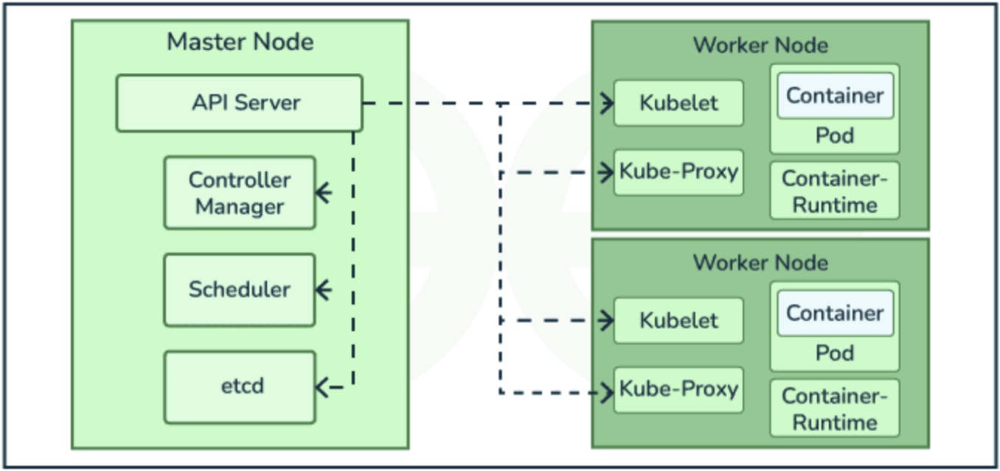
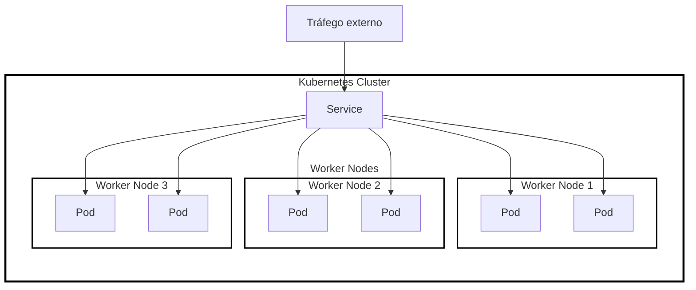

### Introdução a Kubernetes

Kubernetes parece ser muito complicado, mas ele traz muitas vantagens
Vamos usar o MiniKube

Containers facilitam a distribuição de aplicações empacotando o software completo que pode ser construída em uma imagem, executar como container e reproduzida em diferentes ambientes com maior previsibilidade.

Executar um único container é muito diferente de administrar centenas ou milhares deles. Em aplicações distribuídas surgem algumas perguntas:
- Qual servidor cada container deve executar?
- O que deve acontecer quando um container falha?
- Como redistribuir requisições?
- Como aumentar a quantidade de instâncias?
- Como realizar uma atualização sem interromper todo o serviço?

Kubernetes é frequentemente abreviado como K8s, é uma plataforma opensource desenvolvida pelo google destinada a execução e ao gerenciamento de aplicações conteinerizadas distribuidas em um conjunto de máquinas
Em vez de indicar manualmente qual servidor cada container deve executar, o administrador descreve o estado desejado da aplicação e o kubernetes executa as ações. Se declarar que uma aplicação deve ter 3 instâncias e uma delas cai, outra pode ser criada automaticamente.

### Cluster Kubernetes

Um ambiente Kubernetes é **organizado na forma de um cluster**, ou seja, um **conjunto de máquinas que cooperam para executar aplicações**.
O cluster possui duas grandes áreas funcionais (**dois nós**): o **Control Plane**, ou **Master Node**, responsável por **controlar e tomar decisões sobre o estado do ambiente**, e os **Worker Nodes**, responsáveis pela **execução efetiva das aplicações**.
Em ambientes de **produção**, encontramos **múltiplos nós e mecanismos de alta disponibilidade** para **reduzir a **possibilidade** de indisponibilidade** do cluster.



De forma resumida:
- Master Node: responsável por controlar e tomar decisões sobre o estado do ambiente
- API Server: 
- Scheduler: planejamento o que vai rodar e onde
- Controller Manager: quem executa as operações do scheduler
- etcd: database de estado

- Worker Node:
- `kubelet`: agente que roda no worker node (basicamente o kubernetes client, o que vai fazer o worker funcionar)
- `kube-proxy`: interface de rede entre os ambientes internos
- Container:
- Pod: container dentro de uma caixinha onde tem o container rodando e um endereço ip dele. ele não é um container puro pois normalmente não alocam um ip a ele, mas no pod obrigatoriamente sim. é possível rodar varios containeres dentro de um único pod
- Container Runtime: ambiente de execução do container

> Podemos compreender a arquitetura Kubernetes como uma **separação entre decisão e execução**: o **Control Plane determina o que deve ocorrer e os Worker Nodes executam as cargas de trabalho**.

### Control Plane

O control plane funciona como o **cérebro do cluster**. Ele **mantém informações sobre os recursos existentes, recebe comandos administrativos e decide quais ações devem ser executadas**.
Entre seus principais componentes estão: 
- `kube-apiserver`, que disponibiliza a Api Kubernetes. Grande parte das ações (em especial as executadas pelo comando `kubectl`) passam por uma solicitação para a API Kubernetes; 
- `etcd` utilizado para armazenar o estado do cluster;
- `kube-scheduler` responsável por decidir onde novos pods serão executados; 
- `kube-controller-mannager` que executa controladores responsáveis por manter o ambiente no estado desejado

### Worker Nodes

Os worker nodes são as **máquinas responsáveis pela execução das aplicações**. Cada Node disponibiliza recursos como CPU e memória. 
Entre seus principais componentes estão:
- `kubelet` que recebe instruções do Control Plane e verifica se os containers definidos para aquele nó estão realmente em execução;
- `container runtime`, responsável pela execução dos containers e componentes de rede;

### Kubernetes é orientado a objetos

Praticamente tudo é representado como um objeto da API.
Pod, Deployment, Service, ConfigMap, Secret e PersistentVolumeClaim são exemplos de objetos. Esses objetos são normalmente descritos por arquivos YAML

Exemplo de configuração (manifesto) de um Pod. Ele configura dinamicamente a configuração do IP
```yaml
apiVersion: v1
kind: Pod
metadata:
    name: examplo
spec: containers:
    - name: web
    image: nginx # Precisa estar no dockerhub
```

Tudo no kubernetes é temporário, ele é preparado pra recriar cenários dinamicamente. Nesse caso, dados persistentes NUNCA devem ser salvos no container/worker nodes. Devem ser salvos em volumes persistentes.

> **OBS AULA**: SWITCH SAM: Protocolo de rede para transferencia de dados de storage

### Estado desejado e reconciliação

Suponha que um Deployment declare:
- Estado desejado: 3 réplicas da aplicação
- Estado atual: 2 réplicas funcionando
Os controladores Kubernetes identificam essa diferença entre o estado desejado e o estado atual e procuram criar uma nova instância.

### Pod: a unidade básica de execução

O Pod é a **menor unidade de execução** gerenciada pelo Kubernetes
Um Pod contém **um ou mais containeres que compartilham determinados recursos**. Na maioria das aplicações, encontramos um container principal em cada Pod. Cada Pod pode ter IP e volumes associados.
Pods devem ser considerados **efêmeros**, isto é, se um Pod falhar, Kubernetes pode criar outro para substituí-lo. Neste caso, **não se projeta aplicações supondo que um Pod existirá permanentemente**. Ou seja, **dados não devem ser salvos em Pods**.

### Deployment e ReplicaSet

Deployment descreve **características de infraestrutura da aplicação**, como sua imagem, quantidade desejada de réplicas, formas de acesso, estratégia de atualizações, etc. Internamente, o Kubernetes **usa o ReplicaSets para manter o número apropriado de Pods em execução**.

**Se o Deployment declarar 3 réplicas e um Pod desaparecer, o controller cria outro** (mecanismo self-healing do Kubernetes). Deployments também permitem atualizações progressivas da aplicação.

ReplicaSet: conjunto de réplicas que vai usar em um determinado pod

### Manifestos do Kubernetes

#### Definição

É um **arquivo de definição usado para declarar recursos**, normalmente **escrito em YAML**, **descreve o estado desejado do recurso**.
```
kubectl apply -f manifesto.yaml
```

Exemplo de manifesto Deployment
```yaml
apiVersion: apps/v1
kind: Pod
metadata:
    name: minha-aplicacao
spec:
    replicas: 3
    selector:
        matchLabels: # todo mundo que tiver nessa aplicação vai usar isso
            app: minha-aplicação
    template:
        metadata:
            labels:
                app: minha-aplicacao
        spec:
            containers:
            - name: apache
              image: httpd
              ports:
              - containerPort: 80

```

### Labels e Selectors

Como Pods são recursos efêmeros, **aplicações não podem depender diretamente de atributos internos** como nome ou endereço IP. Para tal, Kubernetes utiliza **labels para identificar e organizar seus objetos**.
Um selector permite **localizar objetos que possuem determinadas labels**. **Deployments utilizam selectos para identificar seus Pods**, enquanto **Services utilizam o mesmo mencanismo para descobrir quais Pods devem encaminhar tráfego**.
O objeto **Service cria um acesso estável para um conjunto de Pods**, permitindo que as **instâncias sejam substituídas sem que os clientes precisem conhecer seus novos endereços**.

### E como criar um Service?

```yaml
apiVersion: v1
kind: Service
metadata:
    name: apache-service
spec:
    selector:
        app: apache
    ports:
        - port: 80
          targetPort: 80
    type: ClusterIP
```

O manifesto acima diz ao kubernetes criar um recurso do Tipo Service com o nome `apache-service`, selecionar os Pods com o label app `apache`, expor a porta 80 do Service e encaminhar para a porta 80 dos Pods além de utilizar o tipo ClusterIP.

Service não é acessado externamente pelos usuários, mas é algo interno.

### Tipos de Service e exposição da aplicação

O tipo **ClusterIP cria um endereço acessível apenas dentro do cluster** e é utilizado principalmente na **comunicação entre componentes da aplicação**.
O **NodePort disponibiliza o Service através de uma porta dos Nodes**. É simples e bastante utilizado em laboratórios. **Depende da exposição do IP do worker node ao ambiente externo** ao cluster.

ClusterIp (ip interno ao ambiente, não da pra acessar externamente) e Service são internos
NodePort -> porta externa

> Acesso ao IP de um worker node não acessa diretamente o worker, mas sim o Service, podendo cair em qualquer um dos Pods conectados.



### Formas de acesso externo ao cluster

#### Service type LoadBalancer

Solicita a infraestrutura (em ambiente de cloud gerenciado) um **Load Balancer externo associado ao Service**. Basicamente solicita a AWS para criar o LB.
O cliente **acessa um IP ou DNS externo fornecido pelo LB**, mas **internamente o Service possui um ClusterIP**. Dependendo da implementação, o LB pode usar NodePort como mecanismo interno de encaminhamento

#### Load Balancer Externo

**Um equipamento ou software externo ao Kubernetes para encaminhar tráfego para os Worker Nodes**, como Nginx ou outros LBs.
Normalmente encaminha o tráfego para portas do NotePort do cluster.

#### Ingress


**Permite centralizar o acesso HTTP/HTTPS a múltiplos Services do cluster**. Funciona como um **ponto único de entrada** para aplicações web. Utiliza regras de roteamento baseadas em:
```
Hostname: app1.exmeplo.com, app2.exemplo.com
URL Path: /api, /login
```
O Ingress **não encaminha diretamente para Pods**; ele **encaminha para Services, que então direcionam o tráfego aos Pods**.
**Requer um Ingress Controller instalado no cluster**, como NGINX Ingress Controller ou HAProxy Ingress
O **Ingress Controller** é quem efetivamente **recebe as conexões HTTP/HTTPS e aplica as regras definidas nos objetos** Ingress. Pode realizar também:
- Terminação TLS/HTTPS
- Redirecionamento HTTP -> HTTPS
- Balanceamento de carga entre os Pods através dos Services

Proxy Reverso dentro do ambiente kubernetes e ele tem acesso externo

### Persistência: Volumes, PV e PVC

Containeres e Pods devem ser considerados **recursos descartáveis**. **Dados importantes não devem ficar armazenados dentro deles.**
Kubernetes utiliza **Volumes para disponibilizar armazenamento aos Pods**. Quando o armazenamento precisa persistir, são utilizados **abstrações como o PersistentVolume (PV) e PersistentVolumeClaim (PVC)**.
O **PV representa armazenamento disponibilizado ao cluster**, enquanto o **PVC representa uma solicitação de armazenamento realizada pela aplicação**.

### Scheduling e distribuição dos Pods

Quando um Pod é criado, o **Scheduler precisa decidir em qual Worker Node ele será executado**. Essa decisão considera **recursos disponíveis e as restrições definidas para a aplicação**.
Também é possível **configurar regras para distribuir réplicas entre diferentes Nodes ou zonas, reduzindo a possibilidade de uma única falha interromper todas as instâncias** (como Pod Anti-Affinity)

### Minikube: Kubernetes local para laboratório

[...] mucho texto ignorei

a ideia é que o kubernetes deve ser executado em múltiplas máquinas, enquanto o minikube consegue rodar na mesma maquina. pra migrar do minikube pro kubernetes não é tao complexo, teria q criar algumas coisas espeecificas como o Ingress Controller que o kubernetes original nao tem

### Como o Minikube se relaciona com a arquitetura Kubernetes

[...]

### Minikube como ambiente de experimentação

[...]

### Minikube Multi-Node: simulando um cluster distribuído

[...]