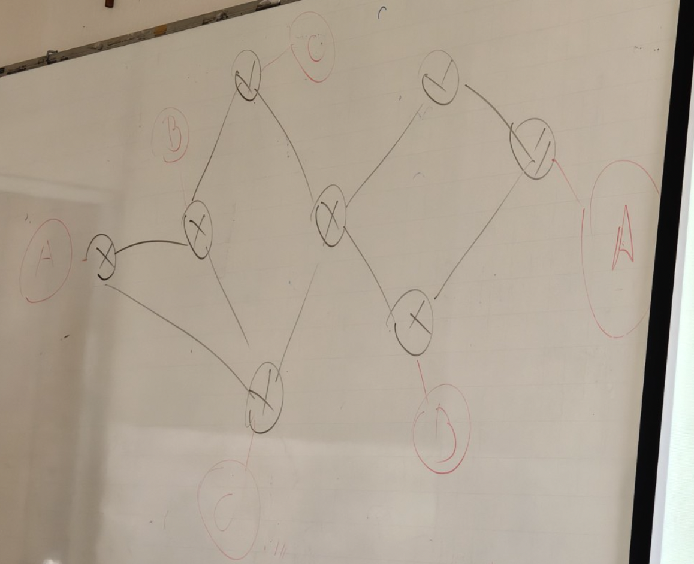
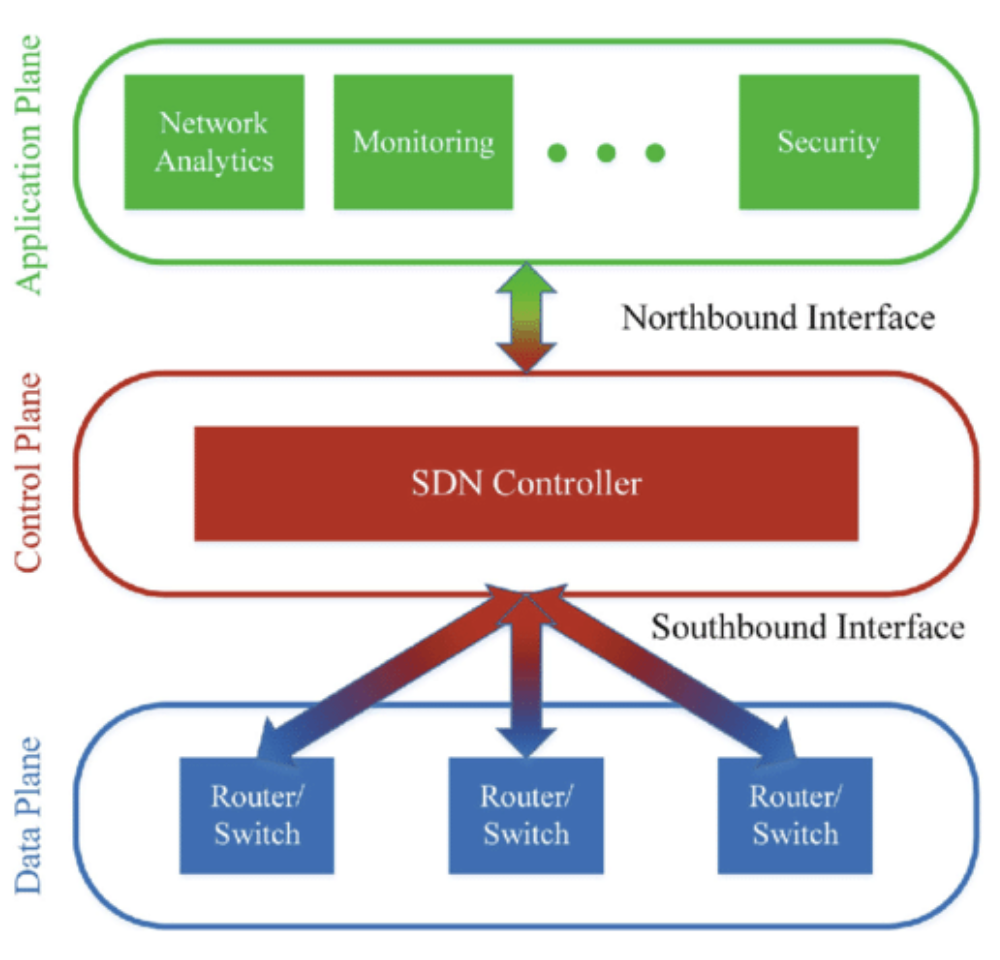

## Redes Virtuais, SDN, NFV e Fabric

Redes em cloud precisa ser flexivel (múltiplos ambientes internos de forma transparente), com menor latência 

### O que são redes virtuais?

- Redes virtuais são **abstrações lógicas construídas sobre uma infraestrutura física**.
- Elas permitem **criar, gerenciar e modificar redes sem a necessidade de existir um equipamento físico dedicado** para cada função.
- A infraestrutura física fornece conectividade, enquanto a rede virtual **define logicamente como os recursos devem se comunicar**.
- Exemplos incluem VLANs (Virtual Lan), redes overlay, VNets/VPCs em cloud e redes utilizadas por máquinas virtuais e conteineres.

### Benefícios das Redes Virtuais

- Escalabilidade: permitem o crescimento da infraestrutura de rede sem a necessidade de novos dispositivos físicos;
- Flexibilidade: novas topologias sem reconfiguração física da rede;
- Redução de custo: otimização de hardware;
- Gerenciamento Simplificado: administração centralizada e automatizada.

### O que é SDN (Software Defined Network)

- SDN é uma abordagem que permite centralizar e automatizar o controle e a configuração da rede.
- Em vez de configurar individualmente cada switch e roteador, o administrador ou uma aplicaçao pode definir políticas, topologias e requisitos de conectividade de forma centralizada.
- O controlador SDN traduz essas necessidades em configurações e regras que são aplicadas aos dispositivos da rede.
- Os switches e roteadores continuam executando o encaminhamento de tráfego utilizando suas interfaces, tablelas, VLANs, rotas, túneis e demais recursos.



> A ideia é entender como fazer uma conexão entre dois pontos de rede A -> A' sem atribuir roteamento dinâmico, uma vez que nesse formato os roteadores aprenderiam todas as rotas e poderia afetar a segurança na comunicação de redes externas.
> Através do SDN, insere a rota A -> A' e o sistema fica responsável por gerar as rotas diretamente com base na regra. No exemplo acima ele gera um roteamento estático, mas poderia ser dinâmico com instância para cada rede.

### Funcionamento do SDN

- **Visão centralizada**: o controlador mantém uma visão lógica da topologia, dos dispositivos e das políticas da rede;
- **Abstração**: administração da rede como um todo no lugar de configurar cada equipamento individualmente;
- **Programação dos Dispositivos**: o controlador usa APIs e protocolos para gerir configurações e regras nos switches e roteadores;
- **Encaminhamento Distríbuido**: encaminhamento de pacotes localmente utilizando regras e tabelas configurados após programação.

Exemplo: ao solicitar conectividade entre dois ambientes, o controlador pode identificar os equipamentos envolvidos e configurar automaticamente VLANs, VXLANs, interfaces, políticas ou rotas necessárias.

> Protocolo NETCONF: configurações em XML com RPC (Remote Procedure Call)

### Três camadas/planos da arquitetura sdn


- **Camada da aplicação**: 
- Plano de controle
- Plano de dados




### Vantagens do SDN

- Gerenciamento Centralizado
- Automação
- Escalabilidade
- Maior visibilidade: visão ampla da topologia, dispositivos e politicas
- Agilidade: mudanças implementadas mais rapidamente

### Casos de Uso do SDN

- Redes em Data Centers (mais usado): provisionamento ágil de redes para novos servidores ou VMs, automatizando a criação e gestão de redes overlay e VLANs.
- Redes WAN (Wide Area Network, longa distância): otimizar o roteamento em grandes redes corporativas, melhorando a eficiência do tráfego entre filiais.
- Redes de Opereadoras: operadoras de telecomunicação podem utilizar para gerenciar redes móveis e fixas de forma mais eficiente e a prova de erros.

### Exemplos de Software e Hardware em SDN

[...] preguiça

### O que é NFV (Network Function Vritualization)?

- NFV é uma abordagem em que funções de rede tradicionalmente executadas por equipamentos dedicados passam a ser implementadas em software.
- Em vez de utilizar um equipamento físico específico para cada função, essas funções podem executar em servidores, máquinas virtuais ou outras plataformas computacionais.
- Exemplos de funções virtualizadas:
  - Firewall
  - Roteador / NAT
  - Proxy
  - IDS / IPS
  - Load Balancer
- NFV e SDN são tecnologias independentes, mas podem ser utilizadas em conjunto para aumentar a automação e a flexibilidade da infraestrutura


```sh
echo "1" > /proc/sys/net/ipv4/ip_forward
sudo apt-get install zebra # roteamento

# Modulo do kernel NETFILTER para firewall
```
Transformar um linux em roteador

### Benefícios do NFV

[...] terminar de copiar

- Redução de custos
- Escalabilidade Dinâmica
- Implantação Rápida
- Automação

Pra que colocar tanta caixa de dispositivo de rede se o linux faz tudo? tudo virtual

### Casos de uso do NFV

[...]

- Operadoras de telecomunicação
- Firewalls e segurança
- SD-WAN

### Management and Orchestration

[...]

### O que é Fabric de Rede?

- Uma Network Fabric é uma arquitetura de rede em malha projetada para oferecer conectividade uniforme entre os dispositivos.
- Ela utiliza múltiplos caminhos entre os elementos da rede, aumentando escalabilidade, disponibilidade e previsibilidade.
- Em data centers, uma implementação comum é a arquitetura **Leaf-Spine**. Nessa arquitetura, cada switch Leaf conecta-se aos switches Spine, permitindo múltiplos caminhos entre servidores e serviços.
- Esse modelo é especialmente adequado para o tráfego **East-West**, comum em ambientes de data center e cloud.

[...] foto as 8h58 do tablet do ximenes

Prover conectividade de qualquer lugar da rede para qualquer lugar da rede sem perder latencia, só um hop
VX-LAN: encapsulamento sem usar trunk (sem spanning-tree)

### Tipos de Fabrics de Rede

[...]

### Como SDN, NFV e Fabrics trabalham juntos?

- Fabric: fornece a infraestrutura de conectividade física ou virtual pela qual o tráfego é transportado.
- SDN: Centraliza e automatiza o controle, as políticas e a configuração da rede.
- NFV: Implementa funções de rede em software, como firewalls, roteadores e balanceadores.

Exemplo: [...]

BGP transporta informações

### 