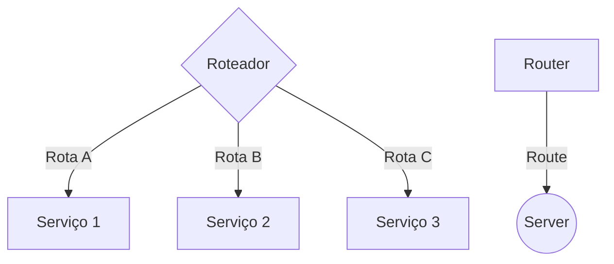
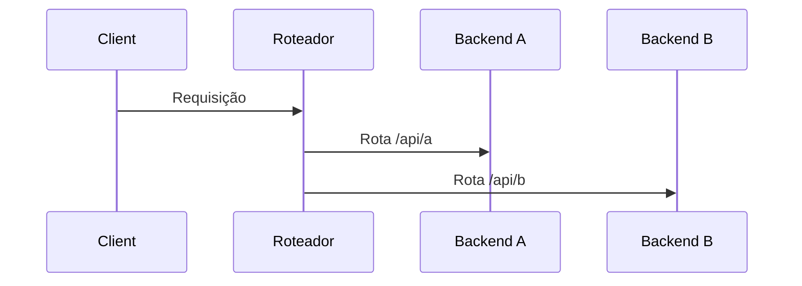

# Cloud

## Introducao

Leaf-spine: totalmente camada 3 (roteado, todas as interfaces tem roteamento IP [não existe switch nesta camada], todo leaf é conectado a todos os spines)

ECMP : Equal cost multipath - balanceamento de carga para caminhos de mesmo custo

caracteristicas do leaf-spine
- qualquer maquina chega a qualquer maquina com 1 hop somente
- multiplos caminhos permitem implementar ECMP
- ausencia de spanning tree (STP, ele remove os multiplos caminhos, impossibilitando LB)
- trafego em qualquer direção

rede hierarquica: trafego em funil, no leaf-spine pode ser em qq fluxo

/28 -> 16 endereços -> 14 alocaveis(endereço de rede e broadcast)
/29 -> 8 endereços -> 6 alocaveis
/30 -> 4 endereços -> 2 alocaveis
/31 -> 2 endereços -> 0 alocaveis

no leaf-spine como cada dispositivo deve estar conectado com todos os outros, colocar /30 ia gerar muitas redes e desperdiçar 50% da rede com broadcast e end. rede. Para facilitar isso, optaram que para conexao ponto a ponto, é possível alocar /31 2 dispositivos (switches em camada 3), descartando rede e broadcast. Isso garante uma maior eficiencia na rede.
cada switch vai ter um ip de gerenciamento e cada interface vai ter uma rede /31

## Tópicos avançados de redes para datacener

BGP
Virtual Extensible Lan
Ethernet VPN

## Da Fabric para BGP e VXLAN

OSPF: menor caminho disponivel com menor custo
BGP: nao prioriza menor caminho ou latencia, os primeiros atributos para calcular é as politicas de roteamento da rede. Altamente customizado, politicas de roteamento que podem ser gerenciadas concorrentemente. 
Utilizado em ambiente de fabric devido suas capacidades, visto que ele tem capacidade de criar suas adjacencias e trocar rotas (troca qq tipo de informacaø uma vez que os dispositivos estao todo sconectados)

## O que é BGP

é um protocolo de roteamento utilizado para trocar informações de alcançabilidade entre diferentes redes IP.

Diferente do OSPF, ele analisa "Quais AS Path (Autonomous System) a rota passa?"
- protocolo de roteamento mais utilizado na internet
- capacidade de trafegar nao somente rotas, mas tambem outros ambientes como backbones MPLS. basicamente a ideia é pegar uma rede grande e criar fluxos internos marcados com label para que não se misturem. ambientes de roteamento isolados, propagados via bgp. FOTO MIN 08:25

## eBGP e iBGP

eBGP: quando a sessão é estabelecida entre roteadores pertencentes a AS diferentes
iBGP: internal BGP: quando os roteadores pertencem ao mesmo AS

## Como uma sessão BGP funciona?

diferente do OSPF
OSPF: quando ativa o router ospf e sobe ele numa interface, ele joga broadcast na rede para identificar outros routes e tenta fazer autenticacao, se necessário. 
BGP: é necessário uma configuracao manual estabelecendo adjacencia de redes.
Foto min 08:28. No primeiro cenario nao tem a conexao direta entre os dois routers, eles estao em um switch e so de conectar e ligar o ospf ele ja funciona, enquanto no bgp é necessário entrar em cada router e criar a conexao -> isso da muito mais trabalho, mas garante mais segurança

## iBGP, Full Mesh e Route Reflector

em ibgp é necessário estabelecer um full mesh, conectar todos os roteadores diretamente, pois se não implementar ele vai entender que algumas rotas podem ter loop de roteamento e vai correr o risco de voltar nele mesmo e cortar o tráfego.
como solução tem o route reflector, que seria um roteador base e os demais replicam (similar ao designated router no ospf)

## BGP Route Reflector

no lugar de todos passarem rotas pra todso, eles mandam pro RR. deve ter um backup pra caso esse cara caia

## O que o BGP anuncia?

anuncia prefixos, a diferença é que os prefixos vem com algumas informacoes adicionais -> OSPF passa prefixo e hierarquia da rede, o BGP passa alem da topologia ele passa o AS Path pra cada um dos destinos. Pode passar mais informacoes pra definir a rota, o as path é um deles

## BGP é um protocolo de path vector

## Principais atributos do BGP

AS_PATH: lista de AS
NEXT_HOP: identifica o endereço ip do proximo roteador a ser utilizado
    Relativo a politica, ele utiliza arp request para identificar como chegar no caminho, pq o next_hop nao necessariamente esta diretamente conectado no bgp. similar a um next hop recursivo. Min 08:38
LOCAL_PREF: permite estabelecer perfêrencias de saída dentro de um AS

## perdi aqui

## BGP vs. OSPF

## BGP em datacenters

Onde é usado em datacenter? comunicacao entre switches leaf-spine. cada um dos switches tem endereço virtual loop-back para gerenciar os switches. min 08:48 - nao entendi mais nada dessa parte

## Por que se faz isso? (Vantagens do eBGP)

## overlay e underlay

## Limitações das VLANs tradicionais

em um ambiente convencional de vlan é possível ate 4096 redes (12 bits), oq é suficiente pra maioria. Mas em um cenário de datacenter que precisa de muitas redes, vem o VXLAN que permite 24 bits, o equivalente a 16 milhoes de redes

## O que é VXLAN

## Encapsulamento VXLAN

Pega o frame ethernet com a tag de vlan e encapsula dentro da area de dados de um pacote iP (duas imagens no min 08:55)

VPN L2 Over L3 -> pacotes L2 encapsuladas em pacotes L3. a flexibilidade é tao grande que permite jogar ate pra outro datacenter

## VNI

Mapeamento de tag de vlan para um VNI. Todo cliente usa os mesmos nomes de VLAN (10,20,30,40), nisso o provedor pode pegar um range de por exemplo 100-200 e mapear para 10100-10200 vni. so que tem que ser manual, pra isso pode usar script em python pra automatizar esse processo.