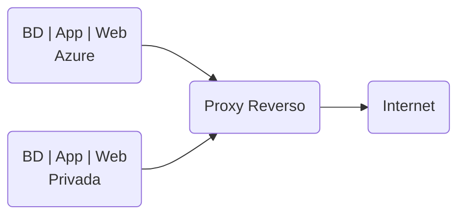
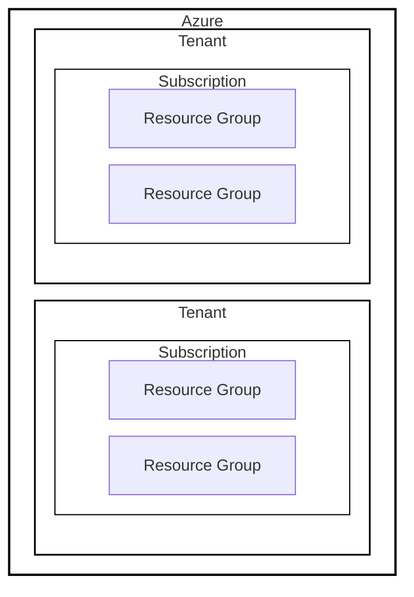

## Tipos de Nuvem

### Conceito de Nuvem Pública

- Ambiente de núvem acessível ao público, de propriedade e mantido por um provedor tercerizado, de forma que múltiplos usuários compartilhem recursos via internet.
- Aluguel de recursos computacionais.
- Vantagens:
  - Escalabilidade;
  - Custo reduzido;
  - Ausência de manutenção por parte do usuário.
- Menor controle sobre aspectos de segurança e personalização dos serviços.
- Exige atenção a custos, configurações e segurança.
- Provedor ganha dinheiro no **oversubscription**, ou seja, vende muito recurso e nunca é utilizado 100% da cota.
- Usos: aplicativos web que exigem flexibilidade e alta disponibilidade; ambientes de desenvolvimento e testes;

### Conceito de Nuvem Privada

- Infraestrutura cloud exclusiva para uma única organização, podendo ser interna ou mantida por um provedor (mas sempre com uso dedicado à organização proprietária).
- Maior controle sobre os recursos e dados, personalização e segurança.
- Custos mais elevados e requer um gerenciamento contínuo.
- Organização atua como provedor e consumidor dos recursos de TI.
- Usos: setores regulados que exisgem alta segurança dos dados ou personalização.

### Núvem privada é mais que um datacenter

**Possuir servidores/datacenter próprio não é necessariamente nuvem privada**, pois ela **precisa implementar caracteristicas específicas de cloud**, como por exemplo **automação, provisionamento sob demanda, elasticidade e gerenciamento centralizado sobre os recursos**.

### Conceito de Nuvem Comunitária

- Nuvem privativa dentro de um grupo de empresas para resolver o problema da nuvem privada ser cara, garantindo a customização. Similar a uma nuvem pública, mas restrito a uma comunidade específica de usuários que comparitlham interesses ou requisitos comuns.
- Permitem o compartilhamento de custos e recursos entre os membros, além de garantir conformidade com normas específicas do setor.
- Frequentemente usada em setores regulatórios como saúde e finanças para cumprir regulações específicas; projetos colaborativos entre diferentes organizações com objetivos e necessidades similares.
- O problema: governança da nuvem. Quem irá administrar e ser responsável pelas decisões? Quais decisões podem ser tomadas?
  - Custos e recursos compartilhados, políticas de segurança comuns.
  - A solução: joint-venture, uma nova empresa onde todos são societários para gerencia da cloud.

### Conceito de Nuvem Híbrida

- Oferece flexibilidade para as organizações permitindo a combinação de elementos de núvem pública, privada e/ou comunitária. 
- Usos: expansão de recursos, migrações graduais, resiliência e continudade de serviços, segurança dos dados (armazenamento dos dados em núvem privada e disponibilidade em nuvem pública)
- O problema: fazer os ambientes trabalharem juntos, necessitando de conectividade segura, maior complexidade de gerenciamento e sincronização, controle de acessos etc.

### Comparando os tipos de nuvem

- A nuvem pública oferece menor controle, mas é mais econômica e escalável, sendo mantida por terceiros.
- A nuvem privada proporciona alto controle e segurança, mas a um custo maior, sendo exclusiva para uma única organização.
- A nuvem comunitária compartilha recursos e custos entre membros de uma comunidade específica, combinando segurança e conformidade com regulamentações.
- A nuvem híbrida integra aspectos dos outros modelos, oferecendo flexibilidade, mas com desafios adicionais na gestão e integração dos ambientes.

### Nuvem Híbrida e Multicloud

Apesar de serem conceitos relacionados, **não são a mesma coisa**. Multicloud reduz a dependência de um único fornecedor, mas ainda utiliza apenas nuvens públicas. Já a nuvem híbrida alterna entre diferentes tipos de ambientes.

### Edge Computing

Para reduzir latência, implementa mini datacenters ao lado de antenas 5G para processamento de dados em tempo real.

### Serverless

Provedor gerencia grande parte da infra necessária para executar uma aplicação, deixando o desenvolvedor focado no código. Recursos sob demanda através de triggers, como schedulers, endpoints de API entre outros.

### Nuvem Soberana e Soberania dos Dados

Alguns cenários é necessário controlar não apenas quem acessa os dados, mas também onde estão armazenados e suas legislações locais. A depender da legislação, o governo pode ter acesso a dados sensíveis.

### RBAC - Role Based Access Control

Protocolo de controle de permissão por grupos

Onde:
- Tenant: empresa
- Subscription: site/projeto
- Resource Group: subdivisões internas

### Explorando a Azure

#### Ambiente Privado dentro de uma Nuvem Pública

O Azure organiza seus recursos em camadas administrativas que ajudam a controlar custos, permissões, políticas e sepração entre ambientes.
[...]