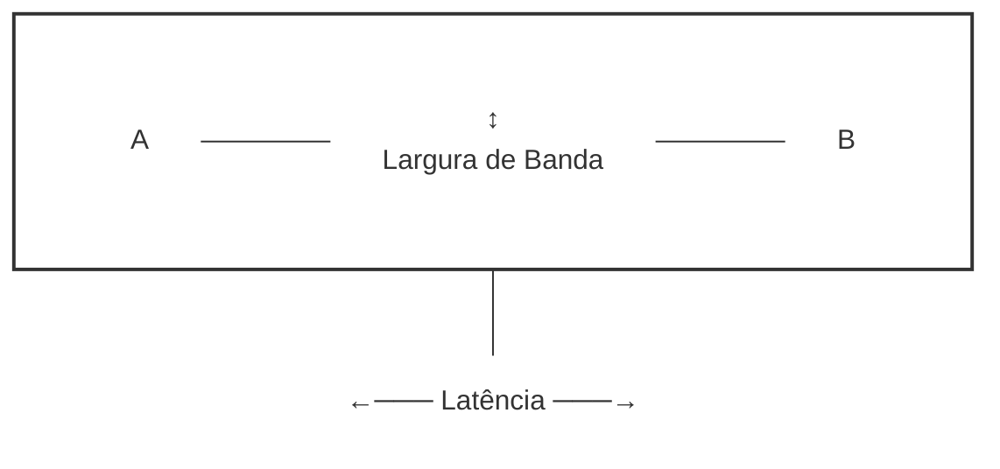

## Redes para Datacenter

### Redes de Computadores

#### Redes Banda Larga e Arquitetura da Internet

- Redes banda larga **permitem a comunicação entre usuários e serviços**;
- A **internet como backbone**, conectando consumidores de nuvem a provedores de serviços;
- Além da internet pública, **conexões dedicadas** como MPLS (Multiprotocol Label Switching) e VPNs (Virtual Private Network) **para maior segurança e/ou desempenho**.

#### Arquitetura da Internet: Níveis

- **Tier 1**: grandes **provedores globais**, responsáveis pela interconexão de redes principais, como AT&T, Claro etc.
- **Tier 2**: **provedores regionais** que compram trânsito de redes Tier 1 e revendem para o nível 3.
- **Tier 3**: **ISPs** (Internet Service Providers) **locais** que compram transito nível 2 e revendem para usuários finais, como a Desktop, Laricel etc.

**A hierarquia de rede garante redundância e resiliência.**

#### Componentes da Arquitetura de Redes

- **Rede Orientada a Pacotes**: transmissão de dados de forma **independente** através da rede.
- **Roteadores e roteamento**: dispositivos que **determinam o caminho ideal para cada pacote baseado na topologia da rede e políticas de roteamento**. Um exemplo de protocolo é o BGP.
- **Protocolos de Rede**: protocolos como TCP/IP garantem a entrega ordenada e confável dos dados.
- **QoS (Qualidade de Serviço)**: técnicas para garantir a prioridade do tráfego em redes congestionadas em aplicativos sensíveis a latência como videoconferência.

#### Problemas de Conectividade na Nuvem

- **Latência**: tempo necessário para que um pacote viaje de um ponto a outro na rede. Crucial para performance em aplicações sensíveis ao tempo.
- **Largura de banda**: capacidade máxima de transmissão de dados entre dois pontos, influenciando diretamente a velocidade de acesso.
- **Jitter e Perda de Pacotes**: variações no atraso e pacotes que não chegam ao destino.
- **Soluções e Otimizações**: CDNs (Content Delivery Networks) para otimização de rotas e tecnologias de compressão de dados para melhorar a conectividade.

> Latência x Largura de Banda: latência é a velocidade no qual os pacotes trafegam na rede, enquanto a largura de banda é o quanto de pacote pode trafegar. 
> Pensando em uma analogia, largura de banda é a altura/espessura de um cano, quanto de agua pode passar, enquanto a latência é o comprimento/distância, indicando quanto tempo demora para sair do Ponto A até o Ponto B.

#### Seleção de Provedor e Operador de Nuvem

- **Impacto dos ISPs**: a qualidade da conexão depende das infraestruturas de ISP usados pelos consumidores e provedores;
- **Colaboração entre ISPs**: acordos de _peering_ e trânsito são essenciais para manter a qualidade e custo das conexões entre redes, em especial conexão entre diferentes países;
- **Custos e Complexidade de Implementação**: múltiplos provedores e caminhos redundantes para garantir alta disponibilidade e reduzir latência;
- **Critérios de Seleção**: SLA (Sevice Level Agreement - contratos), suporte técnico, compliance e segurança.

### Datacenters

**Instalação física que abriga servidores e demais componentes e recursos de TI essenciais**. Representam o **ponto central da infraestrutura de nuvem**, fornecendo recursos computacionais necessários para executar aplicativos e armazenar dados.
A centralização dos componentes em um datacenter é importante essencialmente por eficiência energética, manutenção, otimização de recursos e segurança física.
Os datacenters podem ser on-premise (corporativos/privativos), colocation (sublocação), gerenciados e cloud.

#### Estrutura do Datacenter

- **Camada Física**: hardware, infraestrutura de suporte a resfriação e energia;
- **Camada Virtualizada**: abstração de recursos físicos para a criação de ambientes virtualizados e isolados para um uso eficiente e flexível;
- **Plataformas de Gerenciamento**: sistemas de monitoramento e controle de recursos de TI para alocação, escalonamento e manutenção de serviços;
- **Redundância e Alta Disponibilidade**: estratégias para evitar falhas de serviço como fontes redundantes, backups automatizados etc.

#### Tecnologias Específicas para Gerenciamento de Datacenter

Datacenters modernos **exigem tecnologias especializadas para gestão eficiente de recursos**, garantindo eficiência operacional, redução de custos de manutenção, aumento na disponibilidade e segurança dos recursos de TI.

##### Switches KVM (Keyboard, Video, Mouse)

É um dispositivo que permite o controle de múltiplos servidores a partir de um único teclado, monitor e mouse.

Suas principais vantagens incluem:
- **redução do número de dispositivos de conectividade**, economizando espaço e energia;
- **gerenciamento remoto**, permitindo intervenções sem presença física;
- **rapidez na troca de servidores** durante manutenções periódicas, **facilitando a manutenção**;

##### Módulos RSA e HMC

Módulos RSA (Remote Supervisor Adapter) e HMC (Hardware Management Console) são cartões de gerenciamento remoto que oferecem controle completo sobre servidores, incuindo inicialização e monitoramento de hardware. 
Ambos possuem funcionalidades próximas mas aplicados em escalas diferentes. O HMC em especial é voltado para grandes sitemas legados como mainframes e permite gerenciar múltiplos servidores de uma vez, incluindo recursos de virtualização como LPARs.
Suas principais funções incluem gerenciamento e diagnóstico remoto, monitoramento de hardware como temperatura, ventoinhas e energia, logs e autenticação para segurança. Essas funcionalidades reduzem a necessidade de acesso físico ao datacenter, diminuindo o tempo de resposta a falhas e segurança da informação, além do monitoramento contínuo.

> LPAR: Abreviação de `Logical Partitions`, é basicamente uma quebra do hardware em partições lógicas usado em mainframe. Não é virtualização, é segregação de hardware.

#### Implementações Avançadas de Cabling

Cabeamento estruturado eficiente é essencial para desempenho e escalabilidade de datacenters.
Existem diferentes tipos de cabos, como os de cobre que são usados para conexões de curta distância e fibra óptica, utilizado em conexões de longa distância e alta velocidade dentro e entre datacenters.

Algumas das práticas incluem:
- Gerenciamento eficiente dos cabos com o uso de trilhos e braçadeiras para organização para evitar confusões e obstrução do fluxo de ar;
- Cabeamento redundante, implementando múltiplos caminhos para garantir resiliência;

> Uma forma comum de organização dos cabos é organizar a fiação por baixo do piso elevado e conecta-los diretamente aos hacks, que por sua vez são ordenados internamente através de switches e cabos pequenos.

#### Soluções de Resfriamentos de Datacenter

[...]

#### Gerenciamento de Energia

O consumo de energia elétrica é um dos maiores custos operacionais em datacenters. Neste cenário é essencial sistemas de gerenciamento de energia para monitoramento contínuo do consumo para identificar desperdícios e otimizar a disribuição para redução de custos e minimar o impacto ambiental.
Além disso, é necessário implementação de redundância para garantir disponibilidade ininterrupta através de múltiplas fontes de energia e sistemas de redundância.

##### UPS (Uninterruptible Power Supply)

Técnica para garantir disponibilidade ininterrupta através da redundância, fornecendo energia temporária durante quedas ou falhas de energia, protegendo equipamentos críticos.
Geradores a Diesel atuam como backup de longo prazo, fornecendo energia durante falhas prolongadas após esgotamento do UPS.

> Exemplo de datacenter que vi na internet: salas duplicadas de bateria, que permanecem ligadas somente durante a transição entre a energia elétrica e os geradores a diesel, garantindo disponibilidade.

> "Quem tem um não tem nenhum; Quem tem dois tem um". É essencial ter redundância, como por exemplo as "salas gemeas" para baterias, além de múltiplos provedores de diesel.

#### Segurança Física em Datacenters

- **Grades no teto** para evitar acessos não autorizados através de áreas adjacentes ou superiores. Uma barreira física adicional.
- **Autenticação Biométrico** como impresão digital ou reconhecimento facial para garantir que somente pessoas autenticadas possam acessar o datacenter.
- **Cartões de acesso** muitas vezes combinados com credenciais de segurança pessoal permitem o monitoramento de entrada e saída, além de permitir uma revogação rápida de permissões em cenários específicos.
- **Portas Eclusas** projetadas para garantir que somente uma pessoa entre por vez.