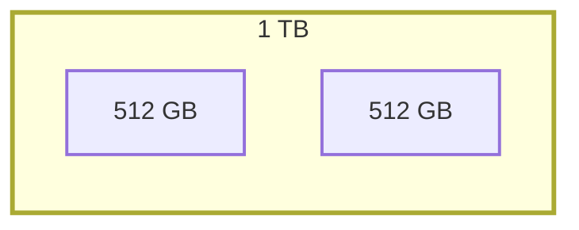
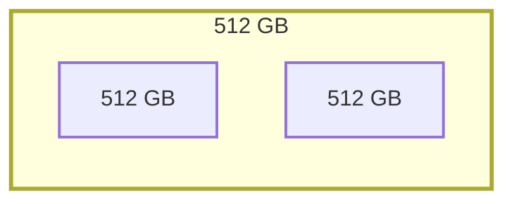
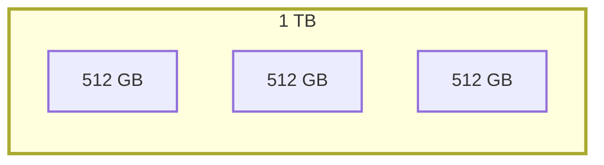
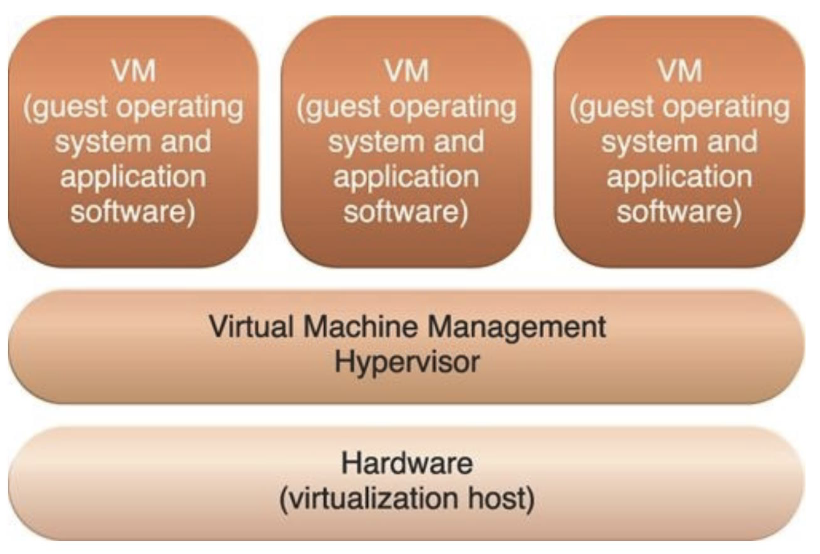
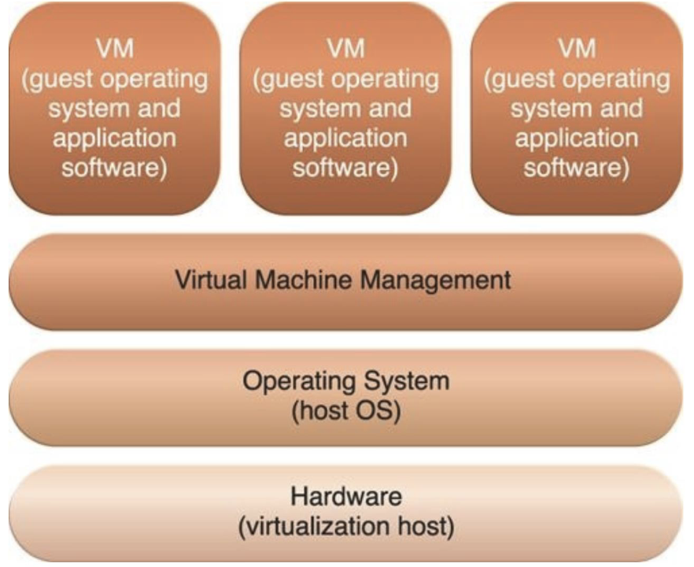
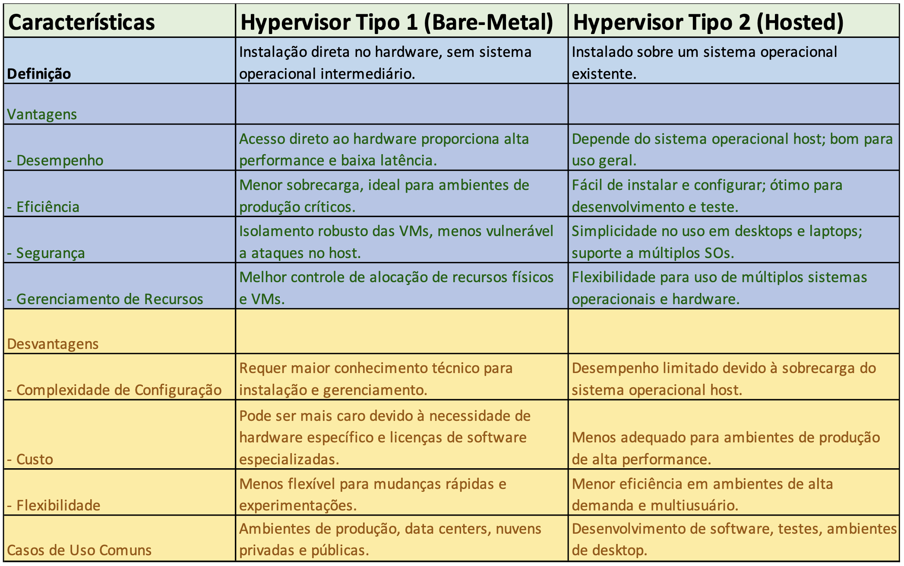

## Virtualização

### Introdução a Virtualização

Virtualização é o **processo de criar uma versão virtual de um recurso de TI**, como servidores, armazenamento e redes.
A virtualização permite uma **redução de custos em hardware físico**, **flexibilidade e escalabilidade na alocação e configuração de recursos**, além na **facilidade de gestão** a partir da centralização do gerenciamento de recursos.

### Componentes da Virtualização de Servidores

#### Hypervisor

Software que permite a criação e execução de VMS fornecendo uma **camada de abstração entre o hardware e os SOs virtuais**, **gerenciando a alocação de recursos para as VMs**, permitindo que **múltiplos SOs rodem em um único hardware físico**.

#### Maquinas Virtuais (VMs)

**Instâncias virtuais de SOs que operam em um ambiente isolado**, agindo como um servidor independente.

##### Imagens de VM

Arquivos que contém uma **cópia completa de um SO** para facilitar a **implantação rápida de novas VMs**, clonagem de ambiente e recuperação em crises.

##### Templates e Clones

Templates são **imagens de VMs pré-configuradas** usadas para criar novas VMs de forma consistente.
Clones são cópias exatas de VMs existentes. Clones podem ser parciais ou inteiros, reproduzem todas as configurações (inclusive MAC ADDRESS, que se não for alterado vai dar conflito no recebimento de pacotes caso duas instâncias estejam ativas).

### Componentes da virtualização de rede

#### Hypervisor de rede

Software que permite a **abstração dos recursos físicos de rede através de redes virtuais independentes**, facilitando a criação de múltiplas redes virtuais independentes dentro de uma única infraestrutura física.

#### Switches Virtuais (vSwitches)

Switches que **permitem e gerenciam o tráfego de rede virtual entre VMs** e permitem a segmentação de redes virtuais.

#### Roteadores Virtuais

Dispositivos virtuais que **desempenham funções de roteamento e encaminhamento de pacote entre sub-redes virtuais**.

#### Firewalls Virtuais

Software de firewall que protege redes ao **controlar o tráfego de entrada e saída da rede virtual** aplicando políticas de segurança similar a um dispositivo físico.

#### Controlador de Rede

Software que **gerencia e controla os recursos de rede virtual**, centralizando o gerenciamento e automação das operações de rede.

#### Overlay Networks (Redes de Sobreposição)

Redes virtuais **criadas sobre a infraestrutura de rede física** usando técnicas como VXLAN, GRE ou NVGRE, permitindo a extensão de redes virtuais através de diferentes locais físicos, facilitando a conectividade entre datacenters.

#### SDN - Software-Defined Network

Gerenciador de redes que permite criar e gerenciar redes através de software configurado via APIs

<!-- Mais detalhes [aqui](#)O que é SDN (Software Defined Network) -->

### RAID - Redundant Array of Independent Disk

É uma tecnologia que **combina múltipos discos usado para aumentar a performance ou redundância do armazenamento** dos dados.

#### RAID 0

Discos físicos atuam como um único disco virtual. Por exemplo, dois discos de 512GB atuam como um disco único de 1TB

#### RAID 1

Discos físicos atuando como backup. 
Seu funcionamento depende da replicação de conteúdo entre discos de forma assíncrona (para evitar delay). Nesse cenário, dois discos de 512GB representam somente um único disco de 512GB.

#### RAID 5

Funcionando com **no mínimo** 3 discos, realiza operações simultâneas e permite aumentar a redundância e armazenamento. 
Seu funcionamento é baseado em operações simultâneas em 2 discos e utiliza o 3 como uma forma de recuperação via paridade (XOR). A principal vantagem é que com 3 discos, somente 1/3 é backup.

<table>
    <thead>
        <tr>
            <td colspan="3" align="center">1 TB</td>
        </tr>
    </thead>
    <tbody>
        <tr>
            <td align="center">1</td>
            <td align="center">0</td>
            <td align="center">[1]</td>
        </tr>
        <tr>
            <td align="center">[0]</td>
            <td align="center">0</td>
            <td align="center">0</td>
        </tr>
        <tr>
            <td align="center">1</td>
            <td align="center">[0]</td>
            <td align="center">1</td>
        </tr>
    </tbody>
</table>

No exemplo acima, se os bits (1, 0) são escritos respectivamente nos discos 0 e 1, através de 1 XOR 0 é possível saber que o valor de paridade é 1 (armazenado no 3 disco). Dessa forma, caso qualquer um dos 3 discos falhe, pode usar o terceiro como conta reversa para recuperar o dado perdido. No entanto, caso dois discos falhem, ai sim o dado é corrompido.

### Componentes de Virtualização de Storage

#### Hypervisor de Storage

Software que abstrai e gerencia os recursos físicos de armazenamento, facilitando a criação de volumes de armazenamento virtual que são independentes do hardware subjacente.

#### Storage Area Network (SAN) Virtual

Rede de armazenamento virtualizada para permitir o acesso a pools de storage compartilhados entre servidores.

#### Network Attached Storage (NAS) Virtual

Dispositivos NAS virtualizados para fornecer de forma centralizada o acesso a arquivos e dados através de uma rede padrão.

#### Pools de Storage

Conjuntos de recursos de armazenamento combinados em uma unidade lógica de armazenamento, permitindo o gerenciamento e a alocação dinâmica de armazenamento cmo base nas necessidades de aplicativos e cargas de trabalho.

#### Snapshots e Clones

Snapshots são cópias de estado de armazenamento em um ponto específico no tempo, enquanto clones são réplicas completas de volumes de armazenamento. Snapshots permitem a restauração rápida de dados, enquanto clones facilitam a replicação de backup de dados.

### Virtualização de Servidores

#### Tipos de Hypervisors

##### Hypervisor Bare-Metal 

Também conhecido como hypervisor tipo 1, é instalado diretamente sobre o hardware físico, proporcionando alto desempenho por possuir acesso direto aos recursos de hardware, além de oferecerem melhor segurança e isolamento para ambientes de virtualização que exigem alta confiança.
Temos como exemplo VMware ESXi, Microsoft Hyper-V, Xen e KVM (quando integrado ao kernel do Linux diretamente no hardware).

##### Hypervisor Hosted

Também conhecido como hypervisor tipo 2, é instalado sobre um sistema operacional já existente, facilitando o uso, mas reduzindo a eficiência. Devido o SO intermediário, adiciona uma camada adicional de software que pode introduzir sobrecarga no desempenho, além de depender de `syscalls` no SO host para acessar o hardware, limitando o desempenho.
São conhecidos pela facilidade no uso e configuração por serem instalados como um aplicativo padrão, mas reduzem o desempenho devido à sobrecarga do SO host.
Temos como exemplo VMWare Workstation, Oracle VirtualBox, Paralles Desktop, Microsoft Virtual PC.

##### Diferenças entre Tipo 1 e Tipo 2

> O ponto essencial aqui é que não necessariamente é preciso usar um hypervisor do tipo 1 se não for um servidor, vai aumentar muito a complexidade do acesso as máquinas pra casos simples

#### Gerenciamento de Recursos

- CPU e Memória: a alocação de recursos feita pelo hypervisor garante isolamento entre VMs, impedindo que uma VM acesse o recurso da outra;
- Armazenamento: discos virtuais são isolados;
- Rede: redes virtuais separadas logicamente usando VLANs e vSwitches para isolar o tráfego de rede de cada VM.

> Basicamente todos os recursos são isolados em cada VM.

##### Isolamento

- CPU e Memória: particionamento de CPU com técnicas como **CPU Pinning** e gerenciamento de memória pelo hypervisor;
- Armazenamento: discos virtuais isolados e técnicas de file locking;
- Rede: VLANs e vSwitches garantem a separação do tráfego da rede;
- Segurança e Controle de Acesso: ACLs, políticas de segurança e criptografia de dados.

#### Para-Virtualização

Técnica de virtualização que modifica o SO convidado para interagir diretamente com o hypervisor.
Seu funcionamento é baseado na modificação do kernel do guest OS para usar hypercalls com o uso de drivers virtuais para comunicação eficiente com o hypervisor.
Garante que as VMs só interajam com o hypervisor, nunca diretamente com o hardware ou outras VMs. Isso garante melhor desempenho e menos overhead, mas em compensação é necessário modificar o guest OS, limitando a compatibilidade.

#### Hypercalls

São interfaces de programação que permitem que o SO convidado faça chamadas diretamente para o hypervisor para realizar que operações necessitariam de acesso ao hardware físico.
Ele funciona substituindo syscalls direcionadas ao hardware por hypercalls ao hypervisor, que executa as chamadas ao hardware físico.

##### Prós do uso de Hypercalls

- **Melhor desempenho**
- **Menor overhead** 
- **Comunicação direta** entre o SO e o hypervisor, facilitando operações.

##### Contras do uso de Hypercalls

- **Necessidade de modificação no SO guest**, que limita alguns SOs que não suportam tal tecnologia;
- **Dependência do Hypervisor** específico do SO guest, limitando portabilidade e flexibilidade.

#### A questão da arquitetura de hardware

**Como a arquitetura de hardware afeta a virtualização**:
- **Execução de código nativo** permite execução direta na CPU;
- **Impacto de arquiteturas diferentes**: arquiteturas diferentes implicam em emulação, introduzindo sobrecarga de desempenho;
- **Compatibilidade e emulação** ineficiente.

#### Compatibilidade de Arquitetura na Virtualização

- Arquitetura de hardware: conjunto de instruções e design que define a capacidade de um processador.
- Dependência de arquitetura em VMs: o guest OS deve ser compilado para a mesma arquitetura do hardware físico para evitar a necessidade de emulação de instruções

Vantagens:
- Desempenho elevado;
- Menor overhead;
- Execução direta no hardware.

Limitações:
- Redução de flexibilidade;
- Restrições de compatibilidade entre SO e hardware.

#### Tópicos que podem ser impactados pela arquitetura na virtualização

##### Independência de Hardware

**Capacidade de mover VMs entre diferentes hosts físicos sem reconfiguração** obrigatória, facilitando a manutenção, atualizações e recuperação de desastres.
A independência de hardware não compromete o isolamento entre VMs mesmo quando são migradas entre hosts.

##### Server Consolidation

Técnica de **executar múltiplas VMs em um único servidor físico** para maximizar a utilização de hardware, reduzindo custos com hardware e energia, garantindo isolamento pelo hypervisor.

#### Funções Avançadas de Virtualização

##### Snapshots

Captura **estado atual da VM**, incluindo estado da memória, discos virtuais e configurações he hardware. São utilizados para **criar ponto s de recuperação** antes de atualizações ou mudanças críticas, permitindo uma restauranção rápida ao estado anterior em caso de falhas e testes.

##### vMotion

Tecnologia que permite a **migração ao vivo de uma VM de um host físico para outro sem interrupção de serviço** transferindo o estado da memória e configurações da VM de um host para outro, mantendo a continuidade das operações, melhorando o balanceamento de carga e facilitando a manutenção.

> A ideia de funcionamento é baseada na sincronização entre VMs de diferentes hosts. Inicialmente ocorre um processo de cópia de memória. Como a máquina continua executando, ao fim do processo de cópia, existe um passo de atualização de dados alterados, uma pausa breve da VM inicial e transferência de estado final para a nova VM. O ponto chave é que a nova VM terá a mesma configuração de rede, a infraestrutura só deve alterar em qual dispositivo físico o MAC Address está localizado.

##### High Avaiability (HA)

Configuração que permite o **reinício automático de VMs em outros hosts em caso de falha do hardware** através de DRS (Distributed Resource Scheduler), uma ferramenta de **balanceamento de carga de trabalho automática entre hosts em um cluster** para otimização de recursos. Proporcional tolerância a falhas completa para VMs críticas, criando uma réplica em tempo real em um segundo host.

> A ideia aqui é uma detecção de falhas + reinicialização em outro host do cluster. Diferente do vMotion, não é uma migração ao vivo, logo não da pra copiar o estado atual da RAM gerando um periodo de indisponibilidade.

> DRS → decide onde as VMs devem ficar para equilibrar recursos.
> vMotion → é o mecanismo que move a VM ligada de um host para outro.
> HA → reage quando um host falha, reiniciando suas VMs em outro host.
> FT → mantém uma réplica da VM em execução simultaneamente em outro host.
#### Desafios na Virtualização de Servidores

- **Compatibilidade de hardware**
- **Segurança**
- **Gerenciamento de recursos**
- **Isolamento de desempenho**